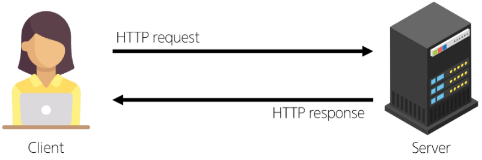
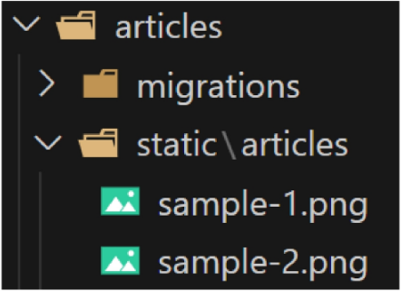

## Django 07 (2025.04.01)

### Static Files

#### 1. Static Files (정적 파일)

- 서버 측에서 변경되지 않고, 고정적으로 제공되는 파일 (이미, JS, CSS 파일 등)

#### 2. 웹 서버와 정적 파일

- 웹 서버의 기본 동작은 특정 위치(URL)에 있는 자원을 요청(HTTP request) 받아서 응답(HTTP response)을 처리하고, 제공하는 것
- 이는 “자원에 접근 가능한 주소가 있다.”라는 의미
- 웹 서버는 요청 받은 URL로 서버에 존재하는 정적 자원을 제공함
- 정적 파일을 제공하기 위한 경로(URL)가 있어야 함



#### 3. Static Files 경로

1. 기본 경로
2. 추가 경로

#### 4. Static Files 기본 경로

- app폴더/static/

#### 5. 기본 경로 Static File 제공하기

- articles/static/articles/ 경로에 이미지 파일 배치



- static files 경로는 DTL의 static tag를 사용해야 함
- built-in tag가 아니기 때문에 load tag를 사용해 import 후 사용 가능

```html
 articles/index.html 


```

- STATIC_URL 확인
    - https://127.0.0.1:8000/static/articles/image01.png

#### 6. STATIC_URL

- 기본 경로 및 추가 경로에 위치한 정적 파일을 참조하기 위한 URL
- 실제 파일이나 디렉토리 경로가 아니며, URL로만 존재
- URL + STATIC_URL + 정적 파일 경로
    - http://127.0.0.1:8000/static/articles/image01.png
    
    ```python
    # settings.py
    STATIC_URL = "static/"
    ```
    

#### 7. Static Files 추가 경로

- STATICFILES_DIRS에 문자열 값으로 추가 경로 설정

#### 8. STATICFILES_DIRS

- 정적 파일의 기본 경로 외에 추가적인 경로 목록을 정의하는 리스트

#### 9. 추가 경로 static file 제공하기

- 임의의 추가 경로 설정

```python
# setting.py
STATICFILES_DIRS = [
    BASE_DIR / "static",
]
```

- 추가 경로에 이미지 파일 배치


- static tag를 사용해 이미지 파일에 대한 경로 제공
    - http://127.0.0.1:8000/static/articles/image01.png
    
    ```html
     articles/index.html 
    
    ```
    

---

### Media Files

#### 1. Media Files

- 사용자가 웹에서 업로드하는 정적 파일 (user-uploaded)

#### 2. ImageField()

- 이미지 업로드에 사용되는 모델 필드
- 이미지 객체가 직접 DB에 저장되는 것이 아닌 ‘이미지 파일의 경로’ 문자열이 저장됨

#### 3. 미디어 파일을 제공하기 전 준비사항

1. settings.py에 MEDIA_ROOT, MEDIA_URL 설정
2. 작성한 MEDIA_ROOT와 MEDIA_URL에 대한 URL 지정

#### 4. MEDIA_ROOT

- 미디어 파일들이 위치하는 디렉토리의 절대 경로

```python
# settings.py
MEDIA_ROOT = BASE_DIR / "media"
```

#### 5. MEDIA_URL

- MEDIA_ROOT에서 제공되는 미디어 파일에 대한 주소를 생성 (STATIC_URL과 동일한 역할)

```python
# settings.py
MEDIA_URL = "media"
```

#### 6. MEDIA_ROOT와 MEDIA_URL에 대한 URL 지정

- 업로드 된 파일의 URL == settings.MEDIA_URL
- MEDIA_URL을 통해 참조하는 파일의 실제 위치 == settings.MEDIA_ROOT

```python
# crud/urls.py
from django.conf import settings
from django.conf.urls.static import static

urlpatterns = [
    path('admin/', admin.site.urls),
    path('articles/', include('articles.urls')),
] + static(settings.MEDIA_URL, document_root=settings.MEDIA_ROOT)
```

#### 7. 이미지 업로드

1. blank=True 속성을 작성해 빈 문자열이 저장될 수 있도록 제약 조건 설정
    - 게시글 작성 시 이미지 업로드 없이도 작성할 수 있도록 하기 위함
    
    ```python
    # articles/models.py
    class Article(models.Model):
        title = models.CharField(max_length=10)
        content = models.TextField()
        image = models.ImageField(blank=True)
        created_at = models.DateTimeField(auto_now_add=True)
        updated_at = models.DateTimeField(auto_now=True)
    ```
    

2. migration 진행
    - ImageFi1eld를 사용하려면 반드시 Pillow 라이브러리가 필요
        - Pillow 라이브러리 설치 명령어
            - `pip install pillow`
            - 설치 후, `pip freeze > requirements.txt`까지 하기

3. form 요소의 enctype 속성 multipart/form-data 추가
    1. enctype은 데이터 전송 방식을 결정하는 속성
        1. 정확히 말하면 인코딩 방식을 결정

```html
<form action="" method="POST" enctype="multipart/form-data">
  
  {{form.as_p}}
  <input type="submit">
</form>
```

4. ModelForm의 2번째 인자로 요청 받은 파일 데이터 작성
    1. ModelForm의 상위 클래스 BaseModelForm의 생성자 함수의 2번째 위치 인자로 파일을 받도록 설정되어 있음
    
    ```python
    def create(request):
        if request.method == "POST":
            form = ArticleForm(request.POST, request.FILES)
        ...
    ```
    

#### 8. 업로드 이미지 제공하기

- ‘url’ 속성을 통해 업로드 파일의 경로 값을 얻을 수 있음
- article.image.url
    - 업로드 파일의 경로
- article.image
    - 업로드 파일의 파일 이름
    
    ```html
     articles/detail.html 
    
    ```
    

- 이미지를 업로드하지 않은 게시물은 detail 템플릿을 렌더링할 수 없음
- 이미지 데이터가 있는 경우만 이미지를 출력할 수 있도록 처리하기

```html
 articles/detail.html 

  

```

## 9. 금일 최종 코드

- crud/urls.py

```python
# crud/urls.py
"""
URL configuration for crud project.

The `urlpatterns` list routes URLs to views. For more information please see:
    https://docs.djangoproject.com/en/4.2/topics/http/urls/
Examples:
Function views
    1. Add an import:  from my_app import views
    2. Add a URL to urlpatterns:  path('', views.home, name='home')
Class-based views
    1. Add an import:  from other_app.views import Home
    2. Add a URL to urlpatterns:  path('', Home.as_view(), name='home')
Including another URLconf
    1. Import the include() function: from django.urls import include, path
    2. Add a URL to urlpatterns:  path('blog/', include('blog.urls'))
"""
from django.contrib import admin
from django.urls import path, include
from django.conf import settings
from django.conf.urls.static import static

urlpatterns = [
    path('admin/', admin.site.urls),
    path('articles/', include('articles.urls')),
]
urlpatterns += static(settings.STATIC_URL, document_root=settings.STATIC_ROOT)
urlpatterns += static(settings.MEDIA_URL, document_root=settings.MEDIA_ROOT)
```

- crud/settings.py

```python
# crud/settings.py
"""
Django settings for crud project.

Generated by 'django-admin startproject' using Django 4.2.20.

For more information on this file, see
https://docs.djangoproject.com/en/4.2/topics/settings/

For the full list of settings and their values, see
https://docs.djangoproject.com/en/4.2/ref/settings/
"""

from pathlib import Path

# Build paths inside the project like this: BASE_DIR / 'subdir'.
BASE_DIR = Path(__file__).resolve().parent.parent

# Quick-start development settings - unsuitable for production
# See https://docs.djangoproject.com/en/4.2/howto/deployment/checklist/

# SECURITY WARNING: keep the secret key used in production secret!
SECRET_KEY = 'django-insecure-s1z#d840_9k)9-2ygm#hr^jfl_f)534grc6qn)m7^@odu0-khf'

# SECURITY WARNING: don't run with debug turned on in production!
DEBUG = True

ALLOWED_HOSTS = []

# Application definition

INSTALLED_APPS = [
    # 1. 직접 생성한 앱
    'articles',
    # 2. 설치한 앱(3rd party library)
    'django_extensions',
    # 3. 내장 앱
    'django.contrib.admin',
    'django.contrib.auth',
    'django.contrib.contenttypes',
    'django.contrib.sessions',
    'django.contrib.messages',
    'django.contrib.staticfiles',
]

MIDDLEWARE = [
    'django.middleware.security.SecurityMiddleware',
    'django.contrib.sessions.middleware.SessionMiddleware',
    'django.middleware.common.CommonMiddleware',
    'django.middleware.csrf.CsrfViewMiddleware',
    'django.contrib.auth.middleware.AuthenticationMiddleware',
    'django.contrib.messages.middleware.MessageMiddleware',
    'django.middleware.clickjacking.XFrameOptionsMiddleware',
]

ROOT_URLCONF = 'crud.urls'

TEMPLATES = [
    {
        'BACKEND': 'django.template.backends.django.DjangoTemplates',
        'DIRS': [],
        'APP_DIRS': True,
        'OPTIONS': {
            'context_processors': [
                'django.template.context_processors.debug',
                'django.template.context_processors.request',
                'django.contrib.auth.context_processors.auth',
                'django.contrib.messages.context_processors.messages',
            ],
        },
    },
]

WSGI_APPLICATION = 'crud.wsgi.application'

# Database
# https://docs.djangoproject.com/en/4.2/ref/settings/#databases

DATABASES = {
    'default': {
        'ENGINE': 'django.db.backends.sqlite3',
        'NAME': BASE_DIR / 'db.sqlite3',
    }
}

# Password validation
# https://docs.djangoproject.com/en/4.2/ref/settings/#auth-password-validators

AUTH_PASSWORD_VALIDATORS = [
    {
        'NAME': 'django.contrib.auth.password_validation.UserAttributeSimilarityValidator',
    },
    {
        'NAME': 'django.contrib.auth.password_validation.MinimumLengthValidator',
    },
    {
        'NAME': 'django.contrib.auth.password_validation.CommonPasswordValidator',
    },
    {
        'NAME': 'django.contrib.auth.password_validation.NumericPasswordValidator',
    },
]

# Internationalization
# https://docs.djangoproject.com/en/4.2/topics/i18n/

LANGUAGE_CODE = 'en-us'

TIME_ZONE = 'UTC'

USE_I18N = True

USE_TZ = True

# Static files (CSS, JavaScript, Images)
# https://docs.djangoproject.com/en/4.2/howto/static-files/

STATIC_URL = 'static/'
STATICFILES_DIRS = [
    BASE_DIR / "static",
]

MEDIA_ROOT = BASE_DIR / "media"
MEDIA_URL = "media/"

# Default primary key field type
# https://docs.djangoproject.com/en/4.2/ref/settings/#default-auto-field

DEFAULT_AUTO_FIELD = 'django.db.models.BigAutoField'

```

- articles/urls.py

```python
# articles/urls.py
from django.urls import path
from . import views

app_name = 'articles'
urlpatterns = [
    path('', views.index, name='index'),
    path('<int:pk>/', views.detail, name='detail'),
    path('create/', views.create, name='create'),
    path('<int:pk>/delete/', views.delete, name='delete'),
    path('<int:pk>/update/', views.update, name='update'),
]
```

- articles/models.py

```python
# articles/models.py
from django.db import models

# Create your models here.
class Article(models.Model):
    title = models.CharField(max_length=10)
    content = models.TextField()
    image = models.ImageField(blank=True, upload_to="%Y/%m/%d/")
    created_at = models.DateTimeField(auto_now_add=True)
    updated_at = models.DateTimeField(auto_now=True)
```

- articles/forms.py

```python
# articles/forms.py
from django import forms
from .models import Article

class ArticleForm(forms.ModelForm):
    class Meta:
        model = Article
        fields = "__all__"
```

- articles/views.py

```python
# articles/views.py
from django.shortcuts import render, redirect
from .models import Article
from .forms import ArticleForm

# 메인 페이지를 응답하는 함수 (+ 전체 게시글 목록)
def index(request):
    # DB에 전체 게시글 요청 후 가져오기
    articles = Article.objects.all()
    context = {
        'articles': articles,
    }
    return render(request, 'articles/index.html', context)

# 특정 단일 게시글의 상세 페이지를 응답 (+ 단일 게시글 조회)
def detail(request, pk):
    # pk로 들어온 정수 값을 활용 해 DB에 id(pk)가 pk인 게시글을 조회 요청 
    article = Article.objects.get(pk=pk)
    context = {
        'article': article,
    }
    return render(request, 'articles/detail.html', context)

def create(request):
    # 1. 요청 메서드가 POST라면
    if request.method == "POST":
        # 1-1. 사용자로부터 받은 데이터를 인자로 form 인스턴스 생성
        form = ArticleForm(request.POST, request.FILES)
        # 1-2. 유효성 검사
        if form.is_valid():
            # 1-3. 유효성 검사에 통과한다면 저장
            article = form.save()
            # 1-4. 상세 페이지로 리다이렉트
            return redirect("articles:detail", article.pk)
    # 2. 요청 메서드가 POST가 아니라면 (GET, PUT, DELETE ...)
    else:
        # 2-1. ArticleForm 인스턴스를 생성
        form = ArticleForm()
    # case 1: 1-2에서 내려왔을 때: 에러 메세지를 담은 form
    # case 2: 2-1이 끝나고 내려왔을 때: 빈 form
    context = {
        "form": form,
    }
    return render(request, "articles/create.html", context)

def delete(request, pk):
    # 어떤 게시글을 지우는지 먼저 조회
    article = Article.objects.get(pk=pk)
    # DB에 삭제 요청
    article.delete()
    return redirect('articles:index')

def update(request, pk):
    # 어떤 글을 수정하는지 먼저 조회
    article = Article.objects.get(pk=pk)
    if request.method == "POST":
        # 사용자가 새로 입력한 데이터를 받아서 form 인스턴스 생성
        form = ArticleForm(request.POST, request.FILES, instance=article)
        if form.is_valid():
            form.save()
            return redirect('articles:detail', article.pk)
    else:
        form = ArticleForm(instance=article)
    context = {
        "article": article,
        "form": form,
    }
    return render(request, "articles/update.html", context)
```

- articles/index.html

```html
 articles/index.html 

<!DOCTYPE html>
<html lang="en">
<head>
  <meta charset="UTF-8">
  <meta name="viewport" content="width=device-width, initial-scale=1.0">
  <title>Document</title>
  <link rel="stylesheet" href="">
</head>
<body>
  <h1>Articles</h1>
  <hr>
   전체 게시글 출력 
  
  
  
    <p>글 번호: {{ article.pk }}</p>
    <a href="">
      <p>글 제목: {{ article.title }}</p>
    </a>
    <p>글 내용: {{ article.content }}</p>
    <hr>
  
</body>
</html>
```

- articles/detail.html

```html
 articles/detail.html 
<!DOCTYPE html>
<html lang="en">
<head>
  <meta charset="UTF-8">
  <meta name="viewport" content="width=device-width, initial-scale=1.0">
  <title>Document</title>
</head>
<body>
  <h1>DETAIL</h1>
  <h2>{{ article.pk }} 번째 글</h2>
  <hr>
  
    
  
  <p>제목 : {{ article.title }}</p>
  <p>내용 : {{ article.content }}</p>
  <p>작성일 : {{ article.created_at }}</p>
  <p>수정일 : {{ article.updated_at }}</p>
  <hr>
  <a href="">[EDIT]</a>
  <form action="" method="POST">
    
    <input type="submit" value="삭제">
  </form>
  <a href="">[back]</a>
</body>
</html>
```

- articles/create.html

```html
 articles/create.html 
<!DOCTYPE html>
<html lang="en">
<head>
  <meta charset="UTF-8">
  <meta name="viewport" content="width=device-width, initial-scale=1.0">
  <title>Document</title>
</head>
<body>
   articles/new.html 
  <h1>CREATE</h1>
  <form action="" method="POST" enctype="multipart/form-data">
    
    {{form.as_p}}
    <input type="submit">
  </form>
  <hr>
  <a href="">[back]</a>
</body>
</html>
```

- articles/update.html

```html
 articles/update.html 
<!DOCTYPE html>
<html lang="en">
<head>
  <meta charset="UTF-8">
  <meta name="viewport" content="width=device-width, initial-scale=1.0">
  <title>Document</title>
</head>
<body>
  <h1>UPDATE</h1>
  <form action="" method="POST" enctype="multipart/form-data">
    
    {{form.as_p}}
    <input type="submit">
  </form>
  <hr>
  <a href="">[back]</a>
</body>
</html>
```

---

### 참고

#### 1. ‘upload_to’ argument

- ImageField()의 upload_to 속성을 사용해 다양한 추가 경로 설정

```python
# 1. 기본 경로 설정
image = models.ImageField(
    blank=True,
    upload_to="images/"
)

# 2. 업로드 날짜로 경로 설정
image = models.ImageField(
    blank=True,
    upload_to="%Y/%m/%d/"
)

# 3. 함수 형식으로 경로 설정
def articles_image_path(instance, filename):
    return f"images/{instance.user.username}/{filename}"
image = models.ImageField(
    blank=True,
    upload_to=articles_image_path,
)
```