## PJT 05 (2025.04.18)

### 데이터베이스 모델링

#### 1. Database Modeling

- 데이터베이스 시스템을 구축하기 위해, 데이터의 구조와 관계, 제약 조건 등을 설계하여 효율적이고 일관성 있는 데이터베이스를 만들기 위한 과정
- 모델링을 통해 성능, 무결성, 신뢰성을 보장할 수 있음

#### 2. Database Modeling의 중요성

- 효율성
    - 데이터베이스 구조를 잘 설계하면 쿼리 성능과 저장 효율이 향상
- 일관성
    - 중복과 이상 현상을 최소화하여, 데이터가 서로 모순되거나 충돌하지 않도록 함
- 무결성 보장
    - 무결성 제약 조건을 모델링 단계에서 설정해두어, 부적절한 데이터를 방지

---

### 무결성 제약 조건

#### 1. 무결성

- 데이터베이스가 잘못된 데이터의 삽입/수정/삭제로부터 보호되어, 데이터의 일관성과 신뢰성을 유지하는 것

#### 2. 대표적인 무결성 제약 조건

1. 개체 무결성 (Entity Integrity)
    1. 기본 키(Primary Key)가 유일(중복 불가)하고 ‘NULL’ 값을 허용하지 않는 제약
    2. 핵심 원칙
        1. 각 레코드는 유일한 식별자를 가져야 함 (PK 중복 불가)
        2. 기본 키는 NULL 값을 가질 수 없음 (필수 값)
        
        ```sql
        CREATE TABLE Student(
            -- NULL 불가능, 중복 불가능
            student_id    INT            PRIMARY KEY
            , name        VARCHAR(50)    NOT NULL
        );
        ```
        

2. 참조 무결성 (Referential Integrity)
    1. 외래 키와 관련된 제약으로, 존재하지 않는 기본 키를 참조하지 못하도록 하는 규칙
    2. 핵심 원칙
        1. 외래 키는 참조 대상 테이블의 기본 키 값을 참조하거나 ‘NULL’을 가질 수 있음
        2. 참조 대상 테이블에 존재하지 않는 기본 키 값은 사용할 수 없음
        3. 외래 키로 연결된 레코드를 삭제/수정할 때, 연쇄 작업(ON DELETE CASCADE 등) 또는 예외 처리를 통해 무결성 유지
        
        ```sql
        CREATE TABLE Department(
            dept_id        INT            PRIMARY KEY
            , dept_name    VARCHAR(50)    NOT NULL
        );
        CREATE TABLE Employee(
            emp_id         INT            PRIMARY KEY
            , emp_name     VARCHAR(50)    NOT NULL
            , dept_id      INT
            -- 참조 무결성 적용
            , FOREIGN KEY (dept_id) REFERENCES Department(dept_id)
        );
        ```
        

3. 도메인 무결성 (Domain Integrity)
    1. 각 속성(컬럼)이 정의된 도메인(값의 범위, 형식)을 벗어나지 않도록 하는 제약
    2. 핵심 원칙
        1. 속성별로 데이터 타입, 길이, 범위 등을 정의해야 함
        2. 값이 해당 범위(도메인)를 벗어나면 삽입/수정이 제한되거나 오류 발생
        
        ```sql
        CREATE TABLE Product(
            product_id     INT               PRIMARY KEY
            -- 가격은 0보다 커야 함
            , price        VARCHAR(10, 2)    CHECK (price > 0)
            -- 특정 값만 허용
            , category     VARCHAR(20)       CHECK (category IN ('전자제품', '의류', '도서'))
        );
        ```
        

#### 3. 그 외 무결성 제약 조건

1. 고유성 (UNIQUE)
    1. 특정 컬럼의 값이 테이블 내에서 중복되지 않도록 제한
    2. 예
        1. 이메일 주소는 한 사용자가 하나만 등록 가능
2. NULL 무결성 (NOT NULL)
    1. 특정 컬럼이 NULL 값을 가질 수 없도록 하는 제약
3. 일반 무결성 (General Integrity)
    1. 위의 특정 제약 조건 외에도, 비즈니스 로직에 따라 추가로 정의하는 무결성 규칙
    2. 예
        1. 은행 잔고가 0 미만이 되지 않도록 하거나, 재고 수량이 음수가 되지 않도록 하는 규칙

---

### 모델링 과정 4단계

#### 1. 데이터베이스 모델링 진행

1. 요구사항 수집 및 분석
    1. 어떤 종류의 데이터를 정리하는지 정보 수집하고, 어떤 작업을 수행해야 하는지 파악하는 단계
        1. 개체 (Entity)
            1. 업무에 필요하고, 유용한 정보를 저장하는 집합적인 것
            2. 예
                1. 고객
                2. 상품
    2. 속성 (Attribute)
        1. 관리하고자 하는 것의 의미를 더 이상 작은 단위로 분리되지 않은 데이터 단위
        2. 예
            1. 고객명
            2. 고객 전화번호
            3. 상품명
            4. 상품 가격
    3. 관계 (Relationship)
        1. 객체 사이의 논리적인 연관성을 의미하는 것
        2. 예
            1. 고객은 다수의 상품을 주문
            2. 상품은 다수의 고객들에게 판매될 수 있음

2. 개념적 설계
    1. 요구사항을 기반으로 데이터베이스의 개념적 모델을 설계
    2. 개체(Entity)와 관계(Relationship)를 식별하고, 개체 간의 관계를 정의하여 ER Diagram을 작성
    
    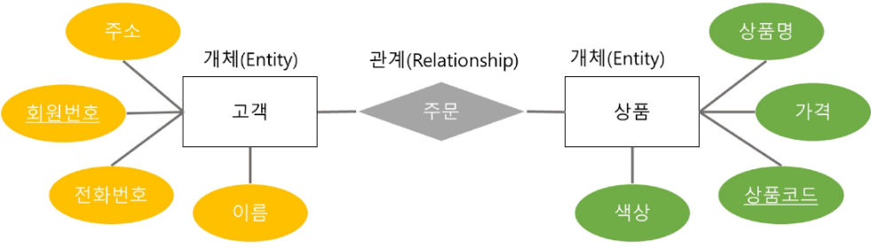
    

3. 논리적 설계
    1. 개념적 설계를 기반으로 데이터베이스의 논리적 구조를 설계
    2. 테이블, 칼럼(속성), 제약 조건 등과 같은 구체적인 데이터베이스 개체를 정의
        1. 정규화를 수행하여 데이터의 중복을 최소화하고 일관성을 유지
        
        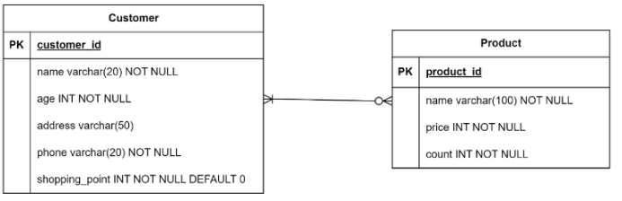
        

4. 물리적 설계
    1. 논리적 설계를 기반으로 데이터베이스를 실제 저장 및 운영할 수 있는 형태로 변환하는 단계
    2. 테이블의 인덱스, 파티션, 클러스터링 등 물리적인 구조와 접근 방식을 결정
    3. 보안, 백업 및 복구, 성능 최적화 등을 고려하여 데이터베이스를 설정

#### 2. ERD 표기 방법

- 까마귀 발 모델(Crow’s Foot Model) 표기법

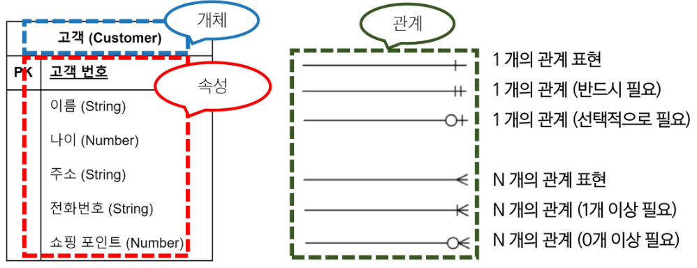

- N:M 관계 예시

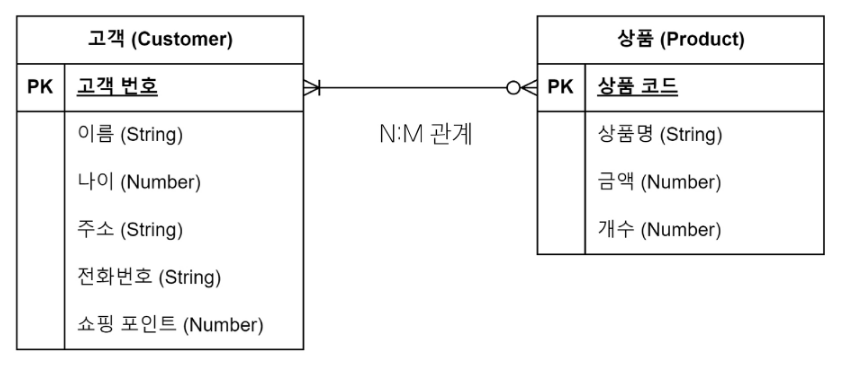

---

### 데이터베이스 정규화

#### 1. 정규화 (Normalization)

- 데이터 중복을 최소화하고, 이상 현상을 예방하며, 데이터베이스 구조 변경 시 재작업을 줄이는 목적으로 테이블을 구조화하는 과정

#### 2. 정규화 목적

1. 중복 최소화
    1. 불필요한 중복 데이터를 제거해 일관성 유지
2. 이상 현상 방지
    1. 삽입, 갱신, 삭제 작업 시 발생할 수 있는 불일치 문제 예방
3. 유연성 향상
    1. 데이터베이스 구조 변경 시 영향을 받는 영역을 최소화하여 유지보수성을 높임

#### 3. 이상 현상 (Anomaly)

- 데이터베이스를 비정상적으로 설계했을 때, 중복된 데이터가 많아져 삽입, 갱신, 삭제 등의 연산에서 비일관성이 생기는 문제

#### 4. 이상 현상 종류

1. 삽입 이상 (Insertion Anomaly)
    1. 새로운 데이터를 삽입하기 위해 불필요한 데이터도 함께 삽입해야 하는 문제
2. 갱신 이상 (Update Anomaly)
    1. 중복된 데이터 중 일부만 변경되어 데이터 불일치가 발생하는 문제
3. 삭제 이상 (Deletion Anomaly)
    1. 어떤 데이터를 삭제할 때, 반드시 있어야 하는 정보까지 같이 사라지는 문제

#### 5. 삽입 이상

- “마늘” 재료만 미리 등록하고 싶어도, 요리 이름이 필요하다는 이유로 가짜 name과 description 등을 만들어야 함
- 새로운 재료 또는 부분적인 정보만을 삽입하기 위해 불필요한 레시피 정보까지 억지로 입력해야 하는 상황이 “삽입 이상”

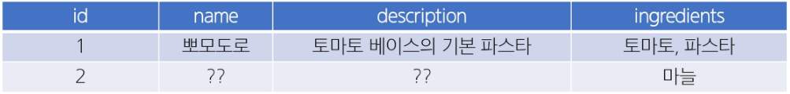

#### 6. 갱신 이상

- “파스타”라는 재료명을 “스파게티”로 변경하고자 하는 상황
- 현재 테이블에서 재료가 문자열로 저장되고 있으므로, ingredients 컬럼 내 “파스타”라는 부분 문자열을 모두 찾아서 일괄 변경해야 함
- 여러 요리에 “토마토, 파스타”, “파스타, 치즈, 면” 등으로 저장되어 있을 수 있는데, 어떤 행은 업데이트가 누락되면, “파스타”와 “스파게티”가 혼재하는 불일치 상황 발생
- 중복된 데이터가 여러 행에 문자열 형태로 산재해 있어, 수정 시 모두 찾아서 변경해야 함
- 일부만 수정하면 불일치(데이터 모순)가 생기는 문제를 갱신 이상이라고 함

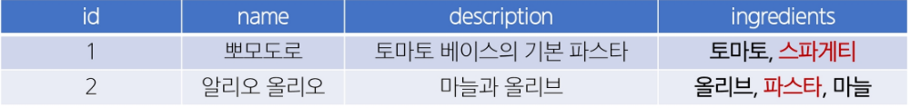

#### 7. 삭제 이상

- “명란 파스타” 정보를 삭제하고자 함
- 이 레시피의 식재료 컬럼에는 올리브, 스파게티, 명란젓이 포함되어 있었음
- 만약 이 테이블에서만 “명란젓”이란 재료 정보를 유일하게 보관하고 있었다면, 해당 행 삭제와 함께 “명란젓” 재료 자체에 대한 정보도 소실되는 결과 초래
- 특정 레시피(행)를 지울 때, 그 행 안에 있는 재료에 대한 정보까지 같이 사라짐
- 실제로는 “재료 정보” 자체는 남겨두고 싶었지만, 테이블 구조상 둘이 붙어 있어서 불필요하게 삭제되는 것이 삭제 이상

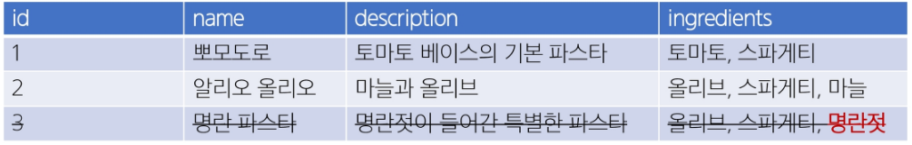

#### 8. 문제 원인

- 하나의 테이블에 요리에 대한 설명, 식별자, 재료 정보 등이 중복된 구조로 뒤섞여 있음
- 재료와 레시피의 관계가 1:N or N:M일 수도 있음에도, 단일 필드(ingredients)로 모아둔 상태

#### 9. 해결 방법 (정규화)

1. 재료(Ingredient)를 별도 테이블로 관리
2. 레시피(Recipe) 테이블 ↔ 재료(Ingredient) 테이블 간 N:M(ManyToMany) 구조를 설정
    1. 예
        1. 중개 테이블 Recipe_Ingredient(recipe_id, ingredient_id)
3. 그렇게 하면
    1. 삽입 이상
        1. “마늘”만 등록할 수 있음 (ingredient 테이블)
        2. 레시피 미정이어도 문제 없음
    2. 갱신 이상
        1. “파스타” → “스파게티”를 Ingredient 테이블에서 한 번만 수정하면, 모든 레시피에 반영
    3. 삭제 이상
        1. 레시피 삭제 시 Ingredient 테이블의 “명란젓”은 남아있을 수 있음
        2. 모두 연결 끊긴 경우에만 자동 삭제 여부를 결정할 수 있음

---

### 정규화

#### 1. 정규화 종류

- 일반적으로 1NF(제 1 정규형)에서 시작해, 2NF, 3NF 순으로 진행하며, 필요에 따라 BCNF 이상(4NF, 5NF, 6NF)까지 고려하기도 함
- 실무에서는 보통 3NF 또는 BCNF까지 도달하면 정규화가 이루어졌다고 표현

#### 2. 각 정규화 단계

- 제 1 정규형 (1NF)
    - 각 요소의 중복되는 항목이 없어야 함
- 제 2 정규형 (2NF)
    - 제 1 정규형을 만족하면서 PK가 아닌 모든 속성이 PK에 완전 함수 종속되어야 함
- 제 3 정규형 (3NF)
    - 제 2 정규형을 만족하면서 모든 속성이 PK에 이행적 함수 종속이 되지 않아야 함
- BCNF (Boyce Codd Normalization Form)
    - 제 3 정규형을 만족하면서, 모든 결정자가 후보 키여야 함

#### 3. 정규화 주의사항

- 3NF 이상으로 들어가면 BCNF, 4NF, 5NF, 6NF 등이 있으나, 지나친 분리로 인한 조인(Join) 증가나 성능 저하 등의 문제가 발생
- 따라서 업무 요구에 따라 필요한 만큼 정규화/반정규화를 조정할 것을 권장

#### 4. 정리

- 정규화는 중복 데이터와 이상 현상을 줄이기 위한 DB 설계 기법
- 일반적으로 1NF → 2NF → 3NF 순으로 진행
- 이상 현상 (Anomaly)
    - 삽입/갱신/삭제 작업에서 생길 수 있는 문제점을 예방
- BCNF
    - 3NF보다 엄격한 규칙으로, 모든 결정자는 후보 키가 되어야 함
- 정규화를 통해 데이터 무결성과 일관성을 확보하고, 유지보수 시 구조 변경 부담을 최소화할 수 있음

---

### 1NF

#### 1. 제 1 정규형 (1NF)

1. 각 속성(컬럼)이 원자 값(Atomic Value), 즉 하나의 값만 가져야 함
2. 중복된 컬럼이 없어야 함
3. 각 행(row)이 유일하게 식별될 수 있어야 함
    1. 기본 키 존재
    
    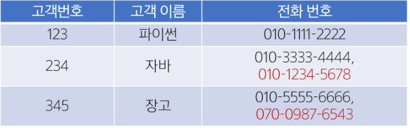
    

#### 2. 제 1 정규형 시도

- 2개를 초과하는 전화번호를 저장할 수 없음
- 해결을 위해 column을 추가하는 경우, 불필요한 NULL 값을 가지게 됨

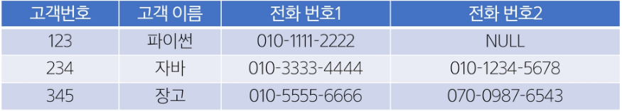

- 동일한 데이터를 여러 row로 나누어서 저장하는 경우, 기본 키가 중복 됨

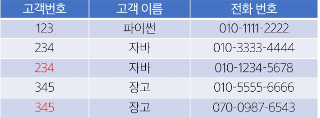

#### 3. 제 1 정규형 결과

- 고객 번호를 참조하여, 전화번호를 저장하는 테이블을 분리

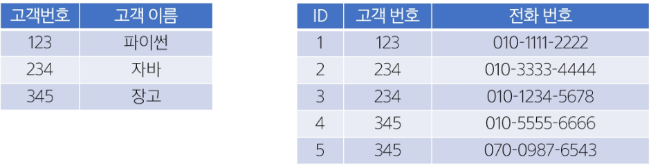

---

### 2NF

#### 1. 제 2 정규형 (2NF)

1. 제 1 정규형을 만족해야 함
2. 복합 키(두 개 이상의 컬럼으로 이루어진 기본 키)를 사용하여 테이블에서 모든 비(非) 기본 키 속성이 기본 키의 모든 컬럼에 완전 종속되어야 함
    1. 즉, 부분 함수 종속(기본 키 일부 컬럼만으로 해당 속성이 결정되는 것)을 제거
    
    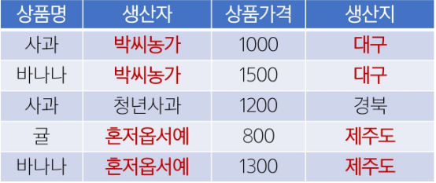
    

#### 2. 제 2 정규형 진행

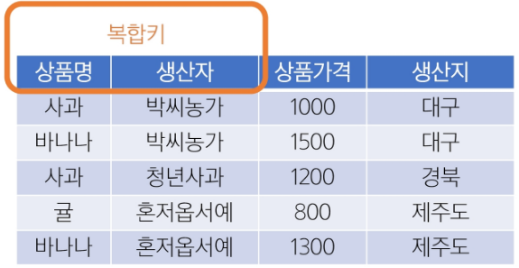

- 완전 함수적 종속


- 부분 함수적 종속


#### 3. 제 2 정규형 결과

- “생산자”와 “생산지”가 완전 함수적 종속이 되도록 테이블 분리

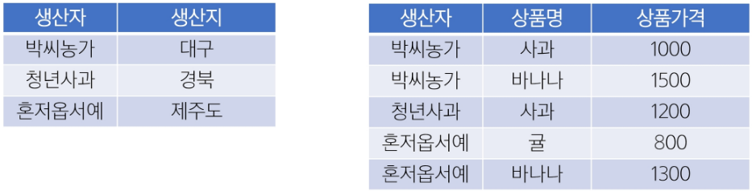

---

### 3NF

#### 1. 제 3 정규형 (3NF)

1. 제 2 정규형을 만족해야 함
2. 기본 키에 대한 이행적 함수 종속(Transitive Dependency)이 없어야 함
    1. A → B, B → C인 경우, A → C를 “이행 종속”이라 부름
    2. 기본 키가 아닌 속성이 다른 속성(역시 기본 키가 아닌)에 의해 결정되지 않아야 함

#### 2. 제 3 정규형의 예

- 학생 테이블에서 학과 번호 → 학과 명 → 대학 이름 식으로 이어진다면, “학과 번호 → 대학 이름” 부분을 별도 테이블로 분리

#### 3. 제 3 정규형 진행

- 기본 키(PK)가 아닌 속성 간의 종속성을 제거해야 함
- 비(非) 기본 키 컬럼이 다른 비 기본 키 컬럼을 결정하면 안 됨
    - 학생 번호 → 학과, 학과 → 학과장
    - 학생 번호는 학과장을 직접 결정하지 않음
        - 이행적 함수 종속 발생
        
        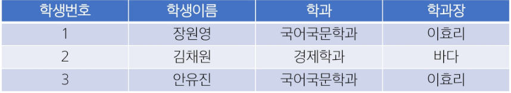
        

#### 4. 제 3 정규형 결과

- “학생 정보”와 “학과 정보”를 별도 테이블로 분리

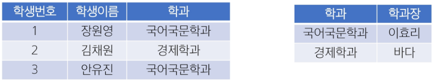

---

### BCNF

#### 1. BCNF (Boyce Codd Normal Form)

1. 제 3 정규형을 만족해야 함
2. 모든 결정자가 후보 키(Candidate Key)여야 함
3. 3NF 이후에도 남아있는 이상 현상을 해결하는 더 엄격한 형태
4. 기본 키가 아닌 속성이 다른 컬럼을 결정할 수 없게끔 테이블을 분해

#### 2. 결정자

- 어떤 속성(또는 속성 집합)이 다른 속성을 결정(함수 종속)할 때, 그 결정자가 곧 후보 키가 되어야 한다는 규칙

#### 3. 후보 키 (Candidate Key)

- 한 테이블의 각 행(row)를 유일하게 식별할 수 있는 속성(또는 속성 조합) 중 최소성을 만족하는 키
- 후보 키의 조건
    - 유일성 (Unique)
        - 테이블의 각 행을 고유하게 식별할 수 있어야 함
    - 최소성 (Minimality)
        - 불필요한 컬럼을 포함하지 않는, 최소한의 속성 조합이어야 함
- 한 테이블에 여러 후보 키가 있을 수 있으며, 그 중 하나를 Primary Key로 선택해야 함

#### 4. 후보 키 예시

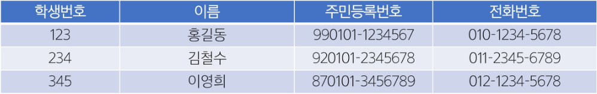

- 학생번호
    - 각 학생을 유일하게 식별 가능 → 후보 키
- 주민등록번호
    - 각 학생을 유일하게 식별 가능 → 후보 키
- 전화번호
    - 일반적으로 유일할 가능성이 높지만, 변경될 수 있음 → 후보 키 가능성 있음
- 이름
    - 동명이인이 존재할 수 있음 → 후보 키 불가능

#### 5. BCNF 진행

- 각 교수는 정확히 한 과목만 담당한다고 가정
    - 담당 교수 → 과목 명
- 한 학생이 한 과목에 대해 받을 학점은 하나뿐
    - (학생번호, 과목 명) → 학점

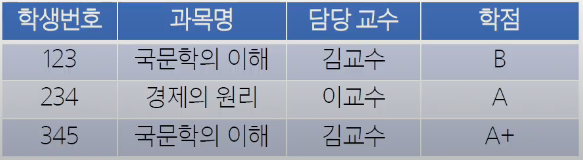

- 후보 키 찾기
- {학생번호, 과목 명}
    - 두 속성을 함께 알면 다른 모든 속성(담당 교수, 학점)을 유일하게 결정
    - 후보 키를 만족
- 과목 명만으로는 중복 학생이 있을 수 있고 학생번호만으로는 여러 과목을 수강하므로 단독으로는 후보 키가 아님


- BCNF 규칙: 모든 결정자(좌항)는 후보 키여야 함
    1. (학생번호, 과목 명) → 학점
        1. 결정자가 후보 키임
    2. 담당 교수 → 과목 명
        1. 결정자가 후보 키가 아님 (담당 교수는 후보 키가 아님)
        2. BCNF 위반
        
        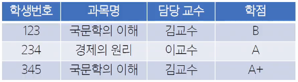
        

- 새로운 관계 설계
- 담당 교수 → 과목 명이 BCNF를 깨뜨리므로 이를 기준으로 분해

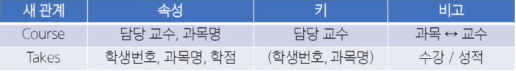

#### 6. BCNF 결과

- 정규화 후 예시 데이터

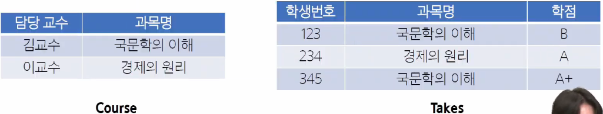