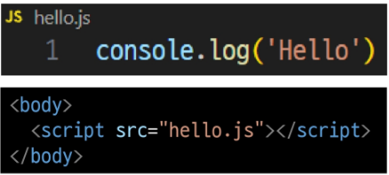
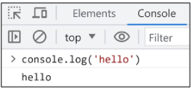
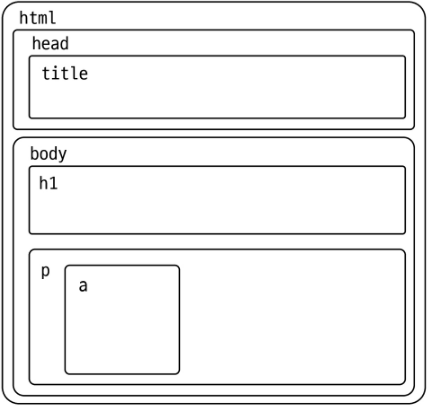
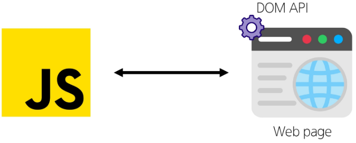
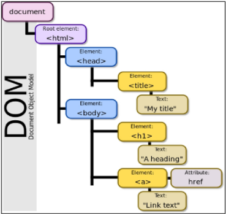
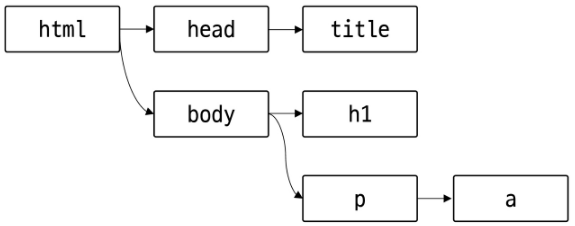
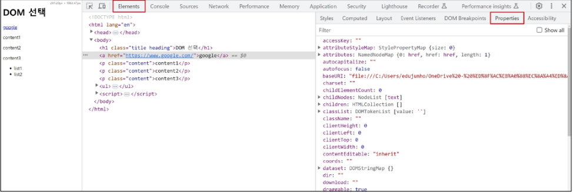
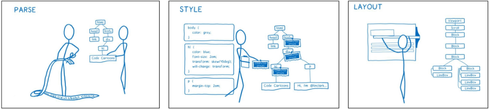

## Javascript 01 (2025.04.21)

### ECMAScript

#### 1. ECMAScript

- Ecma International이 정의하고 있는 표준화된 스크립트 프로그래밍 언어 명세
- 스크립트 언어가 준수해야 하는 규칙, 세부사항 등을 제공

#### 2. ECMAScript와 JavaScript

- JavaScript는 ECMAScript 표준을 구현한 구체적인 프로그래밍 언어
- ECMAScript의 명세를 기반으로 하여 웹 브라우저나 Node.js와 같은 환경에서 실행됨
- ECMAScript는 JavaScript의 표준이며, JavaScript는 ECMAScript 표준을 따르는 구체적인 프로그래밍 언어
- ECMAScript는 언어의 핵심을 정의하고, JavaScript는 ECMAScript 표준을 따라 구현된 언어로 사용됨

#### 3. ECMAScript의 역사

- ECMAScript 5(ES5)에서 안정성과 생산성을 크게 높임 (2009)
- ECMAScript 2015(ES6)에서 객체지향 프로그래밍 언어로써 많은 발전을 이루어, 역사상 가장 중요한 버전으로 평가됨 (2015)

#### 4. JavaScript의 현재

- 현재는 Chrome, Firefox, Safari, Microsoft Edge 등 다양한 웹 브라우저가 경쟁하고 있으며, 모바일 등 시장이 다양화 되어 있음
- 기존에 JavaScript는 브라우저에서만 웹 페이지의 동적인 기능을 구현하는 데에만 사용되었음
    - 예를 들어, 사용자의 입력에 따라 웹 페이지의 내용이 동적으로 변경되거나, 애니메이션 효과가 적용되는 등의 기능
- 이후 Node.js(2009 출시)로 인해 브라우저 외부에서도 실행 가능해져 서버 사이드 개발에도 사용되기 시작함
- 다양한 프레임워크와 라이브러리들이 개발되면서, 웹 개발 분양에서는 필수적인 언어로 자리 잡게 됨

---

### 변수

#### 1. 식별자(변수 명) 작성 규칙

- 반드시 문자, 달러(’$’) 또는 밑줄(’_’)로 시작
- 대소문자를 구분
- 예약어 사용 불가
    - for
    - if
    - function 등

#### 2. 식별자(변수 명) Naming Case

```jsx
1. 카멜케이스(camelCase)
    - 변수, 객체, 함수에 사용
2. 파스칼케이스(PascalCase)
    - 클래스, 생성자에 사용
3. 대문자 스네이크케이스(SNAKE_CASE)
    - 상수(Constants)에 사용
```

#### 3. 변수 선언 키워드 3가지

1. let
    1. 블록 스코프(block scope)를 갖는 지역 변수를 선언
    2. 재할당 가능
    3. 재선언 불가능
    4. ES6에서 추가
    
    ```jsx
    // 1. 선언 및 초기 값 할당
    let number = 10
    // 2. 재할당
    number = 20
    
    // 1. 선언 및 초기 값 할당
    let number = 10
    // 2. 재선언 불가능
    let number = 20
    ```
    

2. const
    1. 블록 스코프를 갖는 지역 변수를 선언
    2. 재할당 불가능
    3. 재선언 불가능
    4. ES6에서 추가
    
    ```jsx
    // 1. 선언 및 초기 값 할당
    const number = 10
    // 2. 재할당 불가능
    number = 10
    
    // 1. 선언 및 초기 값 할당
    const number = 10
    // 2. 재선언 불가능
    const number = 20
    
    // const' declarations must be initialized.
    // 선언 시 반드시 초기 값 설정 필요
    const number
    ```
    

3. var

#### 4. 블록 스코프 (block scope)

- if, for, 함수 등의 ‘중괄호({}) 내부’를 가리킴
- 블록 스코프를 가지는 변수는 블록 바깥에서 접근 불가능

```jsx
	let x = 1
	if(x === 1){
	    let x = 2
	    console.log(x) // 2
	}
	console.log(x) // 1
```

#### 5. 어떤 변수 선언 키워드를 사용해야 할까?

- const를 기본으로 사용
- 필요한 경우에만 let으로 전환
    - 재할당이 필요한 경우
    - let을 사용하는 것은 해당 변수가 의도적으로 변경될 수 있음을 명확히 나타냄
    - 코드의 유연성을 확보하면서도 const의 장점을 최대한 활용할 수 있음

#### 6. const를 기본으로 사용해야 하는 이유

- 코드의 의도 명확화
    - 해당 변수가 재할당되지 않을 것임을 명확히 표현
    - 개발자들에게 변수의 용도와 동작을 더 쉽게 이해할 수 있게 해줌
- 버그 예방
    - 의도치 않은 변수 값 변경으로 인한 버그를 예방
    - 큰 규모의 프로젝트나 팀 작업에서 중요

---

### DOM

#### 1. JavaScript

- 웹 브라우저에서의 JavaScript는 웹 페이지의 동적인 기능을 구현

#### 2. JavaScript 실행 환경 종류

1. HTML script 태그

```html
<body>
    <script>
        console.log('hello')
    </script>
</body>
```

2. js 확장자 파일



3. 브라우저 Console



#### 3. Document Structure (문서 구조)

- HTML 문서는 상자들이 중첩된 형태로 볼 수 있음



```html
<!DOCTYPE html>
<html lang="en">
<head>
  <meta charset="UTF-8">
  <meta name="viewport" content="width=device-width, initial-scale=1.0">
  <title>Document</title>
</head>
<body>
  <h1>Heading</h1>
  <p>Hello,
    <a href="https://www.google.com/">google</a>
  </p>
</body>
</html>
```

- 브라우저가 문서를 표현하기 위해 사용하는 데이터 구조는 위의 사진과 같은 모양을 가짐
- 각 상자는 객체이며 개발자는 이 객체와 상호작용하여 어떤 HTML 태그를 나타내는지, 어떤 콘텐츠가 포함되어 있는지 등을 알아낼 수 있음
- 이 표현을 Document Object Model, 또는 줄여 DOM이라고 부름

#### 4. DOM (The Document Object Model)

- 웹 페이지(Document)를 구조화된 객체로 제공하여 프로그래밍 언어가 페이지 구조에 접근할 수 있는 방법을 제공
- 문서 구조, 스타일, 내용 등을 변경할 수 있도록 함

#### 5. DOM API

- 다른 프로그래밍 언어가 웹 페이지에 접근 및 조작할 수 있도록 페이지 요소들을 객체 형태로 제공하며 이에 따른 메서드 또한 제공



#### 6. document 객체

- 웹 페이지를 나타내는 DOM 트리의 최상위 객체
- HTML 문서의 모든 콘텐츠에 접근하고, 조작할 수 있는 진입점



- DOM에서 모든 요소, 속성, 텍스트는 하나의 객체
- 모두 document 객체의 하위 객체로 구성됨

#### 7. DOM Tree

- HTML 태그를 나타내는 elements의 node는 문서의 구조를 결정
- 이들은 다시 자식 node를 가질 수 있음
    - 예시
        - document.body
        
        
        
        ```html
        <!DOCTYPE html>
        <html lang="en">
        <head>
          <meta charset="UTF-8">
          <meta name="viewport" content="width=device-width, initial-scale=1.0">
          <title>Document</title>
        </head>
        <body>
          <h1>Heading</h1>
          <p>Hello,
            <a href="https://www.google.com/">google</a>
          </p>
        </body>
        </html>
        ```
        

#### 8. DOM 핵심

- 문서의 요소들을 객체로 제공하여 다른 프로그래밍 언어에서 접근하고, 조작할 수 있는 방법을 제공하는 API

---

### DOM 선택

#### 1. DOM 조작 시 기억해야 할 것

- 웹 페이지를 동적으로 만들기 == 웹 페이지를 조작하기
- 조작 순서
    1. 조작 하고자 하는 요소를 선택 (또는 탐색)
    2. 선택된 요소의 콘텐츠 또는 속성을 조작

#### 2. 선택 메서드

```jsx
1. document.querySelector()
    - 요소 한 개 선택
    - 제공한 선택자와 일치하는 element 한 개 선택
    - 제공한 선택자를 만족하는 첫 번째 element 객체를 반환 (없다면 null 반환)

2. document.querySelectorAll()
    - 요소 여러 개 선택
    - 제공한 선택자와 일치하는 여러 element를 선택
    - 제공한 선택자를 만족하는 NodeList를 반환
```

- 예시

```html
<!DOCTYPE html>
<html lang="en">
<head>
  <meta charset="UTF-8">
  <meta name="viewport" content="width=device-width, initial-scale=1.0">
  <title>Document</title>
</head>
<body>
  <h1 class="heading">DOM 선택</h1>
  <a href="https://www.google.com/">google</a>
  <p class="content">content1</p>
  <p class="content">content2</p>
  <p class="content">content3</p>
  <ul>
    <li>list1</li>
    <li>list2</li>
  </ul>
  <script>
    console.log(document.querySelector('.heading'))
    console.log(document.querySelector('.content'))
    console.log(document.querySelectorAll('.content'))
    console.log(document.querySelectorAll('ul > li'))
  </script>
</body>
</html>
```

---

### DOM 조작

#### 1. DOM 조작

```jsx
1. 속성(Attribute) 조작
    - 클래스 속성 조작
    - 일반 속성 조작

2. HTML 콘텐츠 조작

3. DOM 요소 조작

4. 스타일 조작
```

#### 2. 속성 조작

```jsx
1. 클래스 속성 조작

2. 일반 속성 조작
```

#### 3. 클래스 속성 조작

- ‘classList’ property
    - 요소의 클래스 목록을 DOMTokenList(유사 배열) 형태로 반환
- classList 메서드
    
    ```jsx
    1. element.classList.add()
        - 지정한 클래스 값을 추가
    
    2. element.classList.remove()
        - 지정한 클래스 값을 제거
    
    3. element.classList.toggle()
        - 클래스가 존재한다면 제거하고, false를 반환
        - 존재하지 않으면 클래스를 추가하고, true를 반환
    ```
    

- 예시

```html
<!DOCTYPE html>
<html lang="en">
<head>
  <meta charset="UTF-8">
  <meta name="viewport" content="width=device-width, initial-scale=1.0">
  <title>Document</title>
  <style>
    .red {
      color: crimson;
    }
  </style>
</head>
<body>
  <h1 class="heading">DOM 조작</h1>
  <a href="https://www.google.com/">google</a>
  <p class="content">content1</p>
  <p class="content">content2</p>
  <p class="content">content3</p>
  <ul>
    <li>list1</li>
    <li>list2</li>
  </ul>

  <script>
    // 속성 요소 조작
    // 클래스 속성 조작
    const h1Tag = document.querySelector('.heading')
    console.log(h1Tag.classList)

    h1Tag.classList.add('red')
    console.log(h1Tag.classList)

    h1Tag.classList.remove('red')
    console.log(h1Tag.classList)

    // h1Tag.classList.toggle('red')
    // console.log(h1Tag.classList)

    // 일반 속성 조작
    const aTag = document.querySelector('a')
    console.log(aTag.getAttribute('href'))

    aTag.setAttribute('href', 'https://www.naver.com/')
    console.log(aTag.getAttribute('href'))

    aTag.removeAttribute('href')
    console.log(aTag.getAttribute('href'))
  </script>
</body>
</html>
```

#### 4. 일반 속성 조작 메서드

```jsx
1. Element.getAttribute()
    - 해당 요소에 지정된 값을 반환
        - 조회

2. Element.setAttribute(name, value)
    - 지정된 요소의 속성 값을 설정
    - 속성이 이미 있으면 기존 값을 갱신
        - 그렇지 않으면 지정된 이름과 값으로 새 속성이 추가

3. Element.removeAttribute()
    - 요소에서 지정된 이름을 가진 속성 제거
```

- 예시

```html
<!DOCTYPE html>
<html lang="en">
<head>
  <meta charset="UTF-8">
  <meta name="viewport" content="width=device-width, initial-scale=1.0">
  <title>Document</title>
  <style>
    .red {
      color: crimson;
    }
  </style>
</head>
<body>
  <h1 class="heading">DOM 조작</h1>
  <a href="https://www.google.com/">google</a>
  <p class="content">content1</p>
  <p class="content">content2</p>
  <p class="content">content3</p>
  <ul>
    <li>list1</li>
    <li>list2</li>
  </ul>

  <script>
    // 속성 요소 조작
    // 클래스 속성 조작
    const h1Tag = document.querySelector('.heading')
    console.log(h1Tag.classList)

    h1Tag.classList.add('red')
    console.log(h1Tag.classList)

    h1Tag.classList.remove('red')
    console.log(h1Tag.classList)

    // h1Tag.classList.toggle('red')
    // console.log(h1Tag.classList)

    // 일반 속성 조작
    const aTag = document.querySelector('a')
    console.log(aTag.getAttribute('href'))

    aTag.setAttribute('href', 'https://www.naver.com/')
    console.log(aTag.getAttribute('href'))

    aTag.removeAttribute('href')
    console.log(aTag.getAttribute('href'))
  </script>
</body>
</html>
```

#### 5. HTML 콘텐츠 조작

- ‘textContent’ property
    - 요소의 텍스트 콘텐츠를 표현
        - 아래의 코드에서의 textContent는 lorem
        
        ```html
        <p>lorem</p>
        ```
        

- 예시

```html
<!DOCTYPE html>
<html lang="en">
<head>
  <meta charset="UTF-8">
  <meta name="viewport" content="width=device-width, initial-scale=1.0">
  <title>Document</title>
</head>
<body>
  <h1 class="heading">DOM 조작</h1>
  <a href="https://www.google.com/">google</a>
  <p class="content">content1</p>
  <p class="content">content2</p>
  <p class="content">content3</p>
  <ul>
    <li>list1</li>
    <li>list2</li>
  </ul>

  <script>
    // HTML 콘텐츠 조작
    const h1Tag = document.querySelector('.heading')
    console.log(h1Tag.textContent)

    h1Tag.textContent = '내용 수정'
    console.log(h1Tag.textContent)
  </script>
</body>
</html>
```

#### 6. DOM 요소 조작 메서드

```jsx
1. document.createElement(tagName)
    - 작성한 tagName의 HTML 요소를 생성하여 반환

2. Node.appendChild()
    - 한 Node를 특정 부모 Node의 자식 NodeList 중 마지막 자식으로 삽입
    - 추가된 Node 객체를 반환

3. Node.removeChild()
    - DOM에서 자식 Node를 제거
    - 제거된 Node를 반환
```

- 예시

```html
<!DOCTYPE html>
<html lang="en">
<head>
  <meta charset="UTF-8">
  <meta name="viewport" content="width=device-width, initial-scale=1.0">
  <title>Document</title>
</head>
<body>
  <div>
    <p>DOM 요소 조작</p>
  </div>

  <script>
    // 생성
    const h1Tag = document.createElement('h1')
    h1Tag.textContent = '제목'
    console.log(h1Tag)

    // 추가
    const divTag = document.querySelector('div')
    divTag.appendChild(h1Tag)
    console.log(divTag)

    // 삭제
    const pTag = document.querySelector('p')
    divTag.removeChild(pTag)
  </script>
</body>
</html>
```

#### 7. style 조작

- ‘style’ property
    - 해당 요소의 모든 style 속성 목록을 포함하는 속성
- 예시

```html
<!DOCTYPE html>
<html lang="en">
<head>
  <meta charset="UTF-8">
  <meta name="viewport" content="width=device-width, initial-scale=1.0">
  <title>Document</title>
</head>
<body>
  <p>Lorem, ipsum dolor.</p>

  <script>
    const pTag = document.querySelector('p')

    pTag.style.color = 'crimson'
    pTag.style.fontSize = '2rem'
    pTag.style.border = '1px solid black'

    console.log(pTag.style)
  </script>
</body>
</html>
```

---

### 참고

#### 1. DOM 속성 확인 Tip

- 개발자 도구 → Elements → Properties
- 선택한 해당 요소의 모든 DOM 속성 확인 가능



#### 2. 용어 정리

- Node
    - DOM의 기본 구성 단위
    - DOM 트리의 각 부분은 Node라는 객체로 표현됨
        - Document Node
            - HTML 문서 전체를 나타내는 노드
        - Element Node
            - HTML 요소를 나타내는 노드 (예를 들어 <p>)
        - Text Node
            - HTML 텍스트 (Element Node 내의 텍스트 컨텐츠를 나타냄)
        - Attribute Node
            - HTML 요소의 속성을 나타내는 노드
- NodeList
    - DOM 메서드를 사용해 선택한 Node의 목록
    - 배열과 유사한 구조를 가짐
    - Index로만 각 항목에 접근 가능
    - JavaScript의 배열 메서드 사용 가능
    - querySelectorAll()에 의해 반환되는 NodeList는 DOM의 변경사항을 실시간으로 반영하지 않음
        - DOM이 나중에 변경되더라도 이전에 이미 선택한 NodeList 값은 변하지 않음
- Element
    - Node의 하위 유형
    - Element는 DOM 트리에서 HTML 요소를 나타내는 특별한 유형의 Node
    - 예를 들어, <p>, <div>, <span>, <body> 등의 HTML 태그들이 Element 노드를 생성
    - Node의 속성과 메서드를 모두 가지고 있으며, 추가적으로 요소 특화된 기능(예: className, innerHTML, id 등)을 가지고 있음
    - 모든 Element는 Node이지만, 모든 Node가 Element인 것은 아님
- Parsing
    - 구문 분석, 해석
    - 브라우저가 문자열을 해석하여 DOM Tree로 만드는 과정
    
    
    

#### 3. 세미콜론 (semicolon)

- 자바스크립트는 문장 마지막 세미콜론(’;’)을 선택적으로 사용 가능
- 세미콜론이 없으면 ASI에 의해 자동으로 세미콜론이 삽입됨
    - ASI (Automatic Semicolon Insertion, 자동 세미콜론 삽입 규칙)
- JavaScript를 만든 Brendan Eich 또한 세미콜론 작성을 반대

#### 4. 변수 선언 키워드 - ‘var’

- ES6 이전에 변수 선언에 사용했던 키워드
- 재할당 가능
- 재선언 가능
- 함수 스코프(Function Scope)를 가짐
- “호이스팅” 되는 특성으로 인해 예기치 못한 문제 발생 가능
    - 선언하기 전 사용할 수 있음
- 변수 선언 시 var, const, let 키워드 중 하나를 사용하지 않으면, 자동으로 var로 선언됨

#### 5. 함수 스코프 (Function Scope)

- 함수의 중괄호 내부를 가리킴
- 함수 스코프를 가지는 변수는 함수 바깥에서 접근 불가능

```jsx
function foo(){
    var x = 1
    console.log(x) // 1
}
console.log(x) // ReferenceError: x is not defined
```

#### 6. 호이스팅 (Hoisting)

- 변수 선언이 끌어올려 지는 현상
    - var로 선언한 변수는 선언 위치와 상관 없이 함수 시작 지점, 전역에서는 코드가 시작될 때 처리됨
- 변수에 무언가를 할당하기 전까진 undefined를 가짐

```jsx
console.log(name) // undefined
var name = '홍길동' // 선언 및 할당

// 위 코드와 동일하게 동작
var name
console.log(name) // undefined
name = '홍길동'
```

- let과 const로 선언된 변수도 기술적으로는 호이스팅 되지만, 변수가 만들어지는 내부 과정이 다르기 때문에 이 문제를 방지할 수 있음
    - TDZ로 인해 초기화 전에 접근할 수 없음
    
    ```jsx
    console.log(age) // ReferenceError: Cannot access 'age' before initialization
    let age = 30
    
    console.log(height) // ReferenceError: Cannot access 'height' before initialization
    const height = 170
    ```