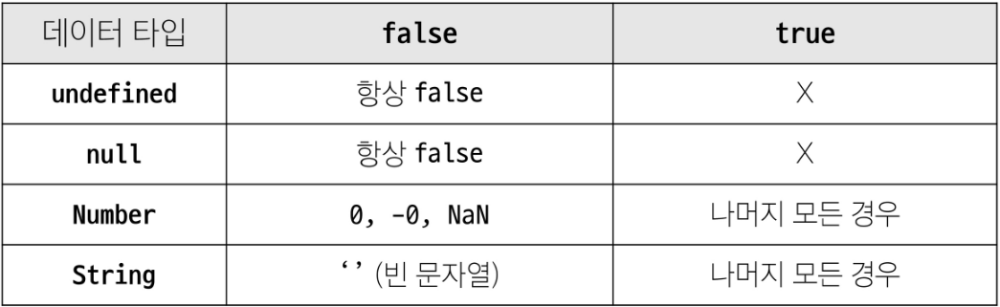
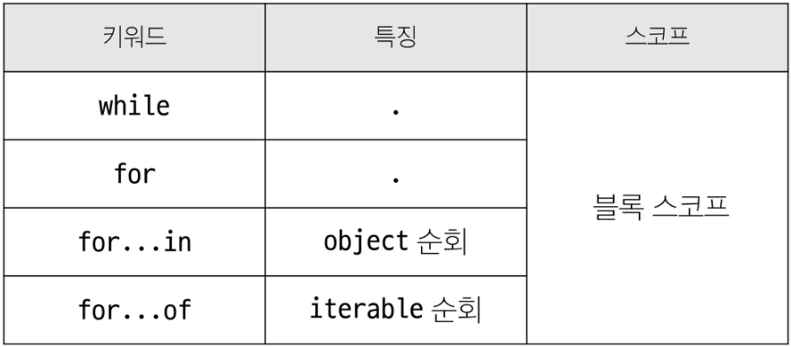

## JavaScript 02 (2025.04.22)

### 데이터 타입

#### 1. 데이터 타입

1. 원시 자료형 (Primitive Type)
    1. 변수에 값이 직접 저장되는 자료형
    2. 불변, 값이 복사
    3. 종류
        1. number
        2. String
        3. Boolean
        4. null
        5. undefined
    4. 예시
        1. 변수에 할당될 때 값이 복사됨
            1. 변수 간에 서로 영향을 미치지 않음
            
            ```jsx
            const a = "bar"
            console.log(a) // bar
            a.toUpperCase()
            console.log(a) // bar
            
            let a = 10
            let b = a
            b = 20
            console.log(a) // 10
            console.log(b) // 20
            ```
            
2. 참조 자료형 (Reference Type)
    1. 객체의 주소가 저장되는 자료형
    2. 가변, 주소가 복사
    3. 종류
        1. Objects
            1. Object
            2. Array
            3. Function
    4. 예시
        1. 객체를 생성하면 객체의 메모리 주소를 변수에 할당
            1. 변수 간에 서로 영향을 미침
            
            ```jsx
            const obj1 = {
                name: "Alice",
                age: 30,
            }
            const obj2 = obj1
            obj2.age = 40
            console.log(obj1.age) // 40
            console.log(obj2.age) // 40
            ```
            

---

### 원시 자료형

#### 1. 원시 자료형 종류

1. Number
    1. 정수 또는 실수형 숫자를 표현하는 자료형
    
    ```jsx
    const a = 13
    const b = -5
    const c = 3.14
    const d = 2.998e8 // 2.998 * 10^8 = 299,800,000
    const e = Infinity
    const f = -Infinity
    const g = NaN // Not a Number를 나타내는 값
    ```
    
2. String
    1. 텍스트 데이터를 표현하는 자료형
    2. ‘+’ 연산자를 사용해 문자열끼리 결합
    3. 뺄셈, 곱셈, 나눗셈 불가능
    
    ```jsx
    const firstName = "Tony"
    const lastName = "Stark"
    const fullName = firstName + lastName
    console.log(fullName) // TonyStark
    ```
    
3. null
4. undefined
5. Boolean
    1. 조건문 또는 반복문에서 Boolean이 아닌 데이터 타입은 “자동 형변환 규칙”에 따라 true 또는 false로 변환됨
    2. true / false

#### 2. Template Literals (템플릿 리터럴)

- 내장된 표현식을 허용하는 문자열 작성 방식
- Backtick(``)을 이용하며, 여러 줄에 걸쳐 문자열을 정의할 수도 있고, JavaScript의 변수를 문자열 안에 바로 연결할 수 있음
- 표현식은 ‘$’와 중괄호({expression})로 표기
- ES6+부터 지원

```jsx
const age = 100
const message = "홍길동은 ${age}세입니다."
console.log(message) // 홍길동은 100세입니다.
```

#### 3. null과 undefined

- null
    - 프로그래머가 의도적으로 ‘값이 없음’을 나타낼 때 사용
    
    ```jsx
    let a = null
    console.log(a) // null
    ```
    

- undefined
    - 시스템이나 JavaScript 엔진이 ‘값이 할당되지 않음’을 나타낼 때 사용
    
    ```jsx
    let b
    console.log(b) // undefined
    ```
    

#### 4. 자동 형변환



---

### 연산자

#### 1. 할당 연산자

- 오른쪽에 있는 피연산자의 평가 결과를 왼쪽 피연산자에 할당하는 연산자
- 단축 연산자 지원

```jsx
let a = 0

a += 10
console.log(a) // 10

a -= 3
console.log(a) // 7

a *= 10
console.log(a) // 70

a %= 7
console.log(a) // 0
```

#### 2. 증가 & 감소 연산자

- 증가 연산자 (’++’)
    - 피연산자를 증가(1을 더함)시키고, 연산자의 위치에 따라 증가하기 전이나 후의 값을 반환
- 감소 연산자 (’—’)
    - 피연산자를 감소(1을 뺌)시키고, 연산자의 위치에 따라 감소하기 전이나 후의 값을 반환
- ‘+=’ 또는 ‘-=’와 같이 더 명시적인 표현으로 작성하는 것을 권장

```jsx
let x = 3
const y = x++
console.log(x, y) // 4 3

let a = 3
const b = ++a
console.log(a, b) // 4 4
```

#### 3. 비교 연산자

- 피연산자들(숫자, 문자, Boolean 등)을 비교하고, 결과 값을 boolean으로 반환하는 연산자

```jsx
3 > 2 // true
3 < 2 // false

"A" < "B" // true
"Z" < "a" // true
"가" < "나" // true
```

#### 4. 동등 연산자 (==)

- 두 피연산자가 같은 값으로 평가되는지 비교 후 boolean 값을 반환
- ‘암묵적 타입 변환’을 통해 타입을 일치시킨 후 같은 값인지 비교
- 두 피연산자가 모두 객체일 경우 메모리의 같은 객체를 바라보는지 판별

```jsx
console.log(1 == 1) // true
console.log("hello" == "hello") // true
console.log("1" == 1) // true
console.log(0 == false) // true
```

#### 5. 일치 연산자 (===)

- 두 피연산자의 값과 타입이 모두 같은 경우 true를 반환
- 같은 객체를 가리키거나, 같은 타입이면서 같은 값인지를 비교
- 엄격한 비교가 이뤄지며 암묵적 타입 변환이 발생하지 않음
- 특수한 경우를 제외하고는 동등 연산자가 아닌 일치 연산자 사용 권장

```jsx
console.log(1 === 1) // true
console.log("hello" === "hello") // true
console.log("1" === 1) // false
console.log(0 === false) // false
```

#### 6. 논리 연산자

- and 연산
    - &&
- or 연산
    - ||
- not 연산
    - !
- 단축 평가 지원

```jsx
true && false // false
true && true // true

false || true // true
false || false // false

!true // false

1 && 0 // 0
0 && 1 // 0
4 && 7 // 7
1 || 0 // 1
0 || 1 // 1
4 || 7 // 4
```

---

### 조건문

#### 1. if

- 조건 표현식의 결과 값을 boolean 타입으로 변환 후, 참/거짓을 판단

```jsx
const name = "customer"

if(name === "admin"{
    console.log("관리자님 환영해요")
} else if(name === "customer"){
    console.log("고객님 환영해요")
} else{
    console.log("반갑습니다. ${name}님")
}
```

#### 2. 삼항 연산자

```jsx
condition ? expression1 : expression2
```

- condition
    - 평가할 조건 (true 또는 false로 평가)
- expression1
    - 조건이 true일 경우 반환할 값 또는 표현식
- expression2
    - 조건이 false일 경우 반환할 값 또는 표현식

#### 3. 삼항 연산자 예시

- 간단한 조건부 로직을 간결하게 표현할 때 유용
- 복잡한 로직이나 대다수의 경우에는 가독성이 떨어질 수 있으므로 적절한 상황에서만 사용할 것

```jsx
const age = 20
const message = (age >= 18) ? "성인" : "미성년자"
console.log(message) // "성인"
```

---

### 반복문

#### 1. 반복문 종류

1. while
    1. 조건문이 참이면 문장을 계속해서 수행
    
    ```jsx
    // while문 문법
    while(조건문){
        // do something
    }
    
    // while문 예시
    let i = 0
    while(i < 6){
        console.log(i)
        i += 1
    }
    ```
    
2. for
    1. 특정한 조건이 거짓으로 판별될 때까지 반복
    
    ```jsx
    // for문 문법
    for([초기문]; [조건문]; [증감문]){
        // do something
    }
    
    // for문 예시
    for(let i = 0; i < 6; i++){
        console.log(i)
    }
    
    // for문 동작 원리
    1. 반복문 진입 및 변수 i 선언
    
    2. 조건문 평가 후 코드 블럭 실행
    
    3. 코드 블록 실행 이후 i 값 증가
    ```
    
3. for … in
    1. 객체의 열거 가능한 속성(property)에 대한 반복
    
    ```jsx
    // for ... in 문법
    for(variable in object){
        statement
    }
    
    // for ... in 예시
    const fruits = {
        a: "apple",
        b: "banana",
    }
    for(const property in fruits){
        console.log(property) // a, b
        console.log(fruits[property]) // apple, banana
    }
    ```
    
4. for … of
    1. 반복 가능한 객체(배열, 문자열 등)에 대해 반복
    
    ```jsx
    // for ... of 문법
    for(variable of iterable){
        statement
    }
    
    // for ... of 예시
    const numbers = [0, 1, 2, 3]
    for(const number of numbers){
        console.log(number) // 0, 1, 2, 3
    }
    ```
    

#### 2. for … in과 for … of 비교 (배열과 객체)

```jsx
// for ... in
// Array
const arr = ["a", "b", "c"]
for(const elem in arr){
    console.log(elem) // 0 1 2
}

// Object
const capitals = {
    korea: "서울",
    japan: "도쿄",
    china: "베이징",
}
for(const capital in capitals){
    console.log(capital) // korea japan china
}
```

```jsx
// for ... of
// Array
const arr = ["a", "b", "c"]
for(const elem of arr){
    console.log(elem) // a b c
}

// Object
const capitals = {
    korea: "서울",
    japan: "도쿄",
    china: "베이징",
}
for(const capital of capitals){
    console.log(capital) // TypeError: capitals is not iterable
}
```

#### 3. 배열 반복과 for … in

- 객체 관점에서 배열의 인덱스는 “정수 이름을 가진 열거 가능한 속성”
- for … in은 정수가 아닌 이름과 속성을 포함하여 열거 가능한 모든 속성을 반환
- 내부적으로 for … in은 배열의 반복자가 아닌 속성 열거를 사용하기 때문에 특정 순서에 따라 인덱스를 반환하는 것을 보장할 수 없음
- for … in은 인덱스의 순서가 중요한 배열에서는 사용하지 않음
- 배열에서는 for문, for … of를 사용
- 객체 관점에서 배열의 인덱스는 정수 이름을 가진 속성이기 때문에 인덱스가 출력됨
    - 순서는 보장하지 않음
    
    ```jsx
    const arr = ["a", "b", "c"]
    
    for(const i in arr){
        console.log(i) // 0 1 2
    }
    
    for(const i of arr){
        console.log(i) // a b c
    }
    ```
    

#### 4. 반복문 사용 시 const 사용 여부

- for문
    - for(let i = 0; i < arr.length; i++){…}의 경우에는 최초 정의한 i를 “재할당”하면서 사용하기 때문에 const를 사용하면 에러 발생
- for … in, for … of
    - 재할당이 아니라, 매 반복마다 다른 속성 이름이 변수에 지정되는 것이므로 const를 사용해도 에러가 발생하지 않음
    - 단, const 특징에 따라 블록 내부에서 변수를 수정할 수 없음

#### 5. 반복문 종합



---

### 함수

#### 1. Function

- 참조 자료형에 속하며 모든 함수는 Function Object

#### 2. 함수 구조

```jsx
function name([param[, param, [..., param]]]){
    statements
    return value
}
```

- function 키워드
- 함수의 이름
- 함수의 매개변수
- 함수의 body를 구성하는 statements
- return 값이 없다면 undefined를 반환

#### 3. 함수 정의 2가지 방법

1. 선언식 (function declaration)

```jsx
// 문법
function funcName(){
    statements
}

// 예시
function add(num1, num2){
    return num1 + num2
}
add(1, 2) // 3
```

2. 표현식 (function expression)

```jsx
// 문법
const funcName = function(){
    statements
}

// 예시
const sub = function(num1, num2){
    return num1 - num2
}
sub(2, 1) // 1
```

#### 4. 함수 선언식 특징

- 호이스팅 됨
- 코드의 구조와 가독성 면에서는 표현식에 비해 장점이 있음

```jsx
add(1, 2) // 3

function add(num1, num2){
    return num1 + num2
}
```

#### 5. 함수 표현식 특징

- 호이스팅 되지 않음
    - 변수 선언만 호이스팅되고 함수 할당은 실행 시점에 이루어짐
- 함수 이름이 없는 ‘익명 함수’를 사용할 수 있음

```jsx
sub(2, 1) // ReferenceError: Cannot access 'sub' before initialization

const sub = function(num1, num2){
    return num1 - num2
}
```

#### 6. 함수 표현식 사용을 권장하는 이유

1. 예측 가능성
    1. 호이스팅의 영향을 받지 않아 코드의 실행 흐름을 더 명확하게 예측할 수 있음
2. 유연성
    1. 변수에 할당되므로 함수를 값으로 다루기 쉬움
3. 스코프 관리
    1. 블록 스코프를 가지는 let이나 const와 함께 사용하여 더 엄격한 스코프 관리가 가능

---

### 매개변수

#### 1. 매개변수 정의 방법

1. 기본 함수 매개변수 (Default Function Parameter)
    1. 전달하는 인자가 없거나 undefined가 전달될 경우 이름 붙은 매개변수를 기본 값으로 초기화
    
    ```jsx
    const greeting = function(name="Anonymous"){
        return `Hi ${name}`
    }
    greeting() // Hi Anonymous
    ```
    
2. 나머지 매개변수 (Rest Parameters)
    1. 임의의 수의 인자를 ‘배열’로 허용하여 가변 인자를 나타내는 방법
    2. 작성 규칙
        1. 함수 정의 시 나머지 매개변수는 하나만 작성할 수 있음
        2. 나머지 매개변수는 함수 정의에서 매개변수 마지막에 위치해야 함
        
        ```jsx
        const myFunc = function(param1, param2, ...restParams){
            return [param1, param2, restParams]
        }
        
        myFunc(1, 2, 3, 4, 5) // [1, 2, [3, 4, 5]]
        myFunc(1, 2) // [1, 2, []]
        ```
        

#### 2. 매개변수와 인자 개수가 불일치할 때

1. 매개변수 개수 > 인자 개수
    1. 누락된 인자는 undefined로 할당
    
    ```jsx
    const threeArgs = function(param1, param2, param3){
        return [param1, param2, param3]
    }
    
    threeArgs()     // [undefined, undefined, undefined]
    threeArgs(1)    // [1, undefined, undefined]
    threeArgs(2, 3) // [2, 3, undefined]
    ```
    
2. 매개변수 개수 < 인자 개수
    1. 초과 입력한 인자는 사용하지 않음
    
    ```jsx
    const noArgs = function(){
        return 0
    }
    noArgs(1, 2, 3) // 0
    
    const twoArgs = function(param1, param2){
        return [param1, param2]
    }
    twoArgs(1, 2, 3) // [1, 2]
    ```
    

---

### Spread Syntax

#### 1. 전개 구문 (Spread Syntax)

- ‘…’로 표현
- 배열이나 문자열과 같이 반복 가능한 항목을 펼치는 것 (확장, 전개)
- 전개 대상에 따라 역할이 다름
    - 배열이나 객체의 요소를 개별적인 값으로 분리하거나, 다른 배열이나 객체의 요소를 현재 배열이나, 객체에 추가하는 등

#### 2. 전개 구문 활용처

1. 함수와의 사용
    1. 함수 호출 시 인자 확장
    2. 나머지 매개변수 (압축)
2. 객체와의 사용
3. 배열과의 활용

#### 3. 전개 구문 활용

- 함수와의 사용
    1. 인자 확장 (함수 호출 시)
    
    ```jsx
    function myFunc(x, y, z){
        return x + y + z
    }
    
    let numbers = [1, 2, 3]
    console.log(myFunc(...numbers)) // 6
    ```
    
    1. 나머지 매개변수 (함수 선언 시)
    
    ```jsx
    function myFunc2(x, y, ...restArgs){
        return [x, y, restArgs]
    }
    
    console.log(myFunc2(1, 2, 3, 4, 5)) // [1, 2, [3, 4, 5]]
    console.log(myFunc2(1, 2))          // [1, 2, []]
    ```
    

---

### 화살표 함수 표현식

#### 1. 화살표 함수 표현식 (Arrow Function Expressions)

- 함수 표현식의 간결한 표현법

```jsx
// 기본 함수 표현식
const arrow = function(name){
    return `hello, ${name}`
}

// 화살표 함수 표현식
const arrow = name => `hello, ${name}`
```

#### 2. 화살표 함수 작성 과정

1. function 키워드 제거 후 매개변수와 중괄호 사이에 화살표(⇒) 작성
2. 함수의 매개변수가 하나 뿐이라면, 매개변수의 ‘()’ 제거 가능
    1. 단, 생략하지 않는 것을 권장
3. 함수 본문의 표현식이 한 줄이라면, ‘{}’와 ‘return’ 제거 가능

```jsx
const arrow1 = function(name){
    return `hello, ${name}`
}

// 1. function 키워드 삭제 후 화살표 작성
const arrow2 = (name) => {return `hello, ${name}`}

// 2. 인자의 소괄호 삭제 (인자가 1개일 경우에만 가능)
const arrow3 = name => {return `hello, ${name}`}

// 3. 중괄호와 return 삭제 (함수 본문이 return을 포함한 표현식 1개일 경우에만 가능)
const arrow4 = name => `hello, ${name}`
```

#### 3. 화살표 함수 심화

```jsx
// 1. 인자가 없다면 () or _로 표시 가능
const noArgs1 = () => "No args"
const noArgs2 = _ => "No args"

// 2-1.object를 return한다면 return을 명시적으로 작성해야 함
const returnObject1 = () => {return {key: "value"}}

// 2-2. return을 작성하지 않으려면 객체를 소괄호로 감싸야 함
const returnObject2 = () => ({key: "value"})
```

---

### 참고

#### 1. NaN을 반환하는 경우 예시

```jsx
1. 숫자로서 읽을 수 없음
    - 예시
        - Number(undefined))

2. 결과가 허수인 수학 계산식
    - 예시
        - Math.sqrt(-1)
        
3. 피연산자가 NaN
    - 예시
        - 1. 7 ** NaN
        
4. 정의할 수 없는 계산식
    - 예시
        - 0 * Infinity
        
5. 문자열을 포함하면서 덧셈이 아닌 계산식
    - 예시
        - ‘가’ / 3
```

#### 2. ‘값이 없음’에 대한 표현이 null과 undefined 2가지인 이유

1. 역사적 맥락
    1. JavaScript가 처음 만들어질 때, null은 ‘객체가 없음’을 나타내기 위해 도입
    2. undefined는 나중에 추가되어 ‘값이 할당되지 않음’을 나타내게 됨
2. null의 타입이 “object”인 이유
    1. 초기 버전에서 값의 타입을 나타내는 데 32비트 시스템을 사용
    2. 타입 태그로 하위 3비트를 사용했는데, ‘000’은 객체를 나타냄
    3. null은 모든 비트가 0인 특별한 값(null pointer)으로 표현되었고, 이로 인해 객체를 잘못 해석
    
    ```jsx
    typeof null      // "object"
    typeof undefined // "undefined"
    ```
    
3. ECMAScript의 표준화
    1. ECMAScript 명세에서는 null을 원시 자료형으로 정의
    2. 그러나 typeof null의 결과는 역사적인 이유로 “object”를 유지
    3. ECMAScript 5 개발 중 이 문제를 수정하려는 시도가 있었지만, 기존 웹 사이트들의 호환성 문제로 인해 받아들여지지 않음
    
    ```jsx
    null == undefined  // true
    null === undefined // false
    ```