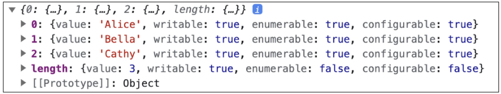

## JavaScript 03 (2025.04.23)

### 객체

#### 1. Object

- 키로 구분된 데이터 집합(data collection)을 저장하는 자료형

#### 2. 객체 구조

- 중괄호(’{}’)를 이용해 작성
- 중괄호 안에는 key: value 쌍으로 구성된 속성(property)를 여러 개 작성 가능
- key는 문자형만 허용
- value는 모든 자료형 허용

```jsx
const user = {
    name: "Alice",
    "key with space": true,
    greeting: function(){
        return "hello"
    }
}
```

#### 3. 속성 참조

- 점(’.’, changing operator) 또는 대괄호(’[]’)로 객체 요소 접근
- key 이름에 띄어쓰기 같은 구분자가 있으면 대괄호 접근만 가능

```jsx
// 조회
console.log(user.name) // Alice
console.log(user["key with space"]) // true

// 추가
user.address = "korea"
console.log(user) // {name: "Alice", key with space: true, address: "korea", greeting: f}

// 수정
user.name = "Bella"
console.log(user.name) // Bella

// 삭제
delete user.name
console.log(user) // {key with space: true, address: "korea", greeting: f}
```

#### 4. ‘in’ 연산자

- 속성이 객체에 존재하는지 여부를 확인

```jsx
console.log("greeting" in user) // true
console.log("country" in user) // false
```

#### 5. Method

- 객체 속성에 정의된 함수
- ‘this’ 키워드를 사용해 객체에 대한 특정한 작업을 수행할 수 있음

#### 6. Method 사용 예시

- object.method() 방식으로 호출
- 메서드는 객체를 “행동”할 수 있게 함

```jsx
console.log(user.greeting()) // hello
```

#### 7. ‘this’ keyword

- 함수나 메서드를 호출한 객체를 가리키는 키워드
- 함수 내에서 객체의 속성 및 메서드에 접근하기 위해 사용
- JavaScript에서 this는 함수를 “호출하는 방법”에 따라 가리키는 대상이 다름
    - 호출 방법
        1. 단순 호출
            1. 가리키는 대상
                1. 전역 객체
                
                ```jsx
                const myFunc = function(){
                    return this
                }
                console.log(myFunc()) // window
                ```
                
        2. 메서드 호출
            1. 가리키는 대상
                1. 메서드를 호출한 객체
                
                ```jsx
                const myObj = {
                    data: 1,
                    myFunc: function(){
                        return this
                    }
                }
                console.log(myObj.myFunc()) // myObj
                ```
                

#### 8. Method & this 사용 예시

```jsx
const person = {
    name: "Alice",
    greeting: function(){
        return `Hello my name is ${this.name}`
    },
}
console.log(person.greeting()) // Hello my name is Alice
```

#### 9. 중첩된 함수에서의 this 문제점과 해결책

```jsx
const myObj2 = {
    numbers: [1, 2, 3],
    myFunc: function(){
        this.numbers.forEach(function(number){
            console.log(this) // window
        })
    },
}
console.log(myObj2.myFunc())
```

- forEach의 인자로 작성된 함수는 일반적인 함수 호출이기 때문에 this가 전역 객체를 가리킴

```jsx
const myObj3 = {
    numbers: [1, 2, 3],
    myFunc: function(){
        this.numbers.forEach((number) => {
            console.log(this) // myObj3
        })
    },
}
```

- 화살표 함수는 자신만의 this를 가지지 않기 때문에 외부 함수(myFunc)에서의 this 값을 가져옴

#### 10. JavaScript ‘this’ 정리

- JavaScript의 함수는 호출될 때 this를 암묵적으로 전달 받음
- JavaScript에서 this는 함수가 “호출되는 방식”에 따라 결정되는 현재 객체를 나타냄
- Python의 self와 Java의 this가 선언 시 이미 값이 정해지는 것에 비해 JavaScript의 this는 함수가 호출되기 전까지 값이 할당되지 않고, 호출 시에 결정됨 (동적 할당)
- this가 미리 정해지지 않고, 호출 방식에 의해 결정되는 것
    - 장점
        - 함수(메서드)를 하나만 만들어 여러 객체에서 재사용할 수 있음
    - 단점
        - 이런 유연함이 실수로 이어질 수 있음
- 개발자는 this의 동작 방식을 충분히 이해하고, 장점을 취하면서 실수를 피하는 데에 집중

---

### 추가 객체 문법

#### 1. 단축 속성

- 키 이름과 값으로 쓰이는 변수의 이름이 같은 경우, 단축 구문을 사용할 수 있음

```jsx
// 단축 속성 적용 전
const name = "Alice"
const age = 30
const user = {
    name: name,
    age: age,
}

// 단축 속성 적용 후
const name = "Alice"
const age = 30
const user = {
    name,
    age,
}
```

#### 2. 단축 메서드

- 메서드 선언 시 function 키워드 생략 가능

```jsx
// 단축 메서드 적용 전
const myObj1 = {
    myFunc: function(){
        return "Hello"
    },
}

// 단축 메서드 적용 후
const myObj2 = {
    myFunc(){
        return "Hello"
    },
}
```

#### 3. 계산된 속성 (Computed Property Name)

- 키가 대괄호([])로 둘러싸여 있는 속성
- 고정된 값이 아닌 변수 값을 사용할 수 있음

```jsx
const product = prompt("물건 이름을 입력해주세요")
const prefix = "my"
const suffix = "property"
const bag = {
    [product]: 5,
    [prefix + suffix]: "value",
}
console.log(bag) // {연필: 5, myproperty: 'value'}
```

#### 4. 구조 분해 할당 (Destructing Assignment)

1. 배열 또는 객체를 분해하여 객체 속성을 변수에 쉽게 할당할 수 있는 문법

```jsx
const userInfo = {
    firstName: "Alice",
    userId: "alice123",
    email: "alice123@gmail.com",
}
// 구조 분해 할당 적용 전
const firstName = userInfo.name
const userId = userInfo.userId
const email = userInfo.email

// 구조 분해 할당 적용 후
const {firstName} = userInfo
const {firstName, userId} = userInfo
const {firstName, userId, email} = userInfo

// Alice alice123 alice123@gmail.com
console.log(firstName, userId, email)
```

2. ‘함수의 매개변수’로 객체 구조 분해 할당 활용 가능

```jsx
const person = {
    name: "Bob",
    age: 35,
    city: "London",
}

function printInfo({name, age, city}){
    console.log(`이름: ${name}, 나이: ${age}, 도시: ${city}`)
}

// 함수 호출 시 객체를 구조 분해하여 함수의 매개변수로 전달
printInfo(person) // 이름: Bob, 나이: 35, 도시: London
```

#### 5. Object with ‘전개 구문’

- “객체 복사”
    - 객체 내부에서 객체 전개
- 얕은 복사에 활용 가능

```jsx
const obj = {
    b: 2,
    c: 3,
    d: 4,
}
const newObj = {
    a: 1,
    ...obj,
    e: 5,
}
console.log(newObj) // {a: 1, b: 2, c: 3, d: 4, e: 5}
```

#### 6. 유용한 객체 메서드

- Object.keys()
- Object.values()

```jsx
const profile = {
    name: "Alice",
    age: 30,
}
console.log(Object.keys(profile)) // ['name', 'age']
console.log(Object.values(profile)) // ['Alice', 30]
```

#### 7. Optional Chaining (’?.’)

- 속성이 없는 중첩 객체를 에러 없이 접근할 수 있는 방법
- 만약 참조 대상이 null 또는 undefined라면 에러가 발생하는 것 대신 평가를 멈추고, undefined를 반환
- 만약 Optional Chaining을 사용하지 않는다면 다음과 같이 ‘&&’ 연산자를 사용해야 함

```jsx
const user = {
    name: "Alice",
    greeting: function(){
        return "hello"
    }
}
console.log(user.address.street) // Uncaught TypeError
console.log(user.address?.street) // undefined
console.log(user.nonMethod) // Uncaught TypeError
console.log(user.nonMethod?.()) // undefined
console.log(user.address && user.address.street) // undefined
```

#### 8. Optional Chaining 장점

- 참조가 누락될 가능성이 있는 경우 연결된 속성으로 접근할 때 더 짧고 간단한 표현식을 작성할 수 있음
- 어떤 속성이 필요한지에 대한 보증이 확실하지 않는 경우에 객체의 내용을 보다 편리하게 탐색할 수 있음

#### 9. Optional Chaining 주의사항

1. Optional Chaining은 존재하지 않아도 괜찮은 대상에만 사용해야 함 (남용 X)
    1. 왼쪽 평가대상이 없어도 괜찮은 경우에만 선택적으로 사용
    2. 중첩 객체를 에러 없이 접근하는 것이 사용 목적이기 때문
    
    ```jsx
    // 아래 코드에서 user 객체는 논리상 반드시 있어야 하지만 address는 필수 값이 아님
    // user에 값을 할당하지 않은 문제가 있을 때 바로 알아낼 수 있어야 하기 때문
    const user = {
        name: "Alice",
        greeting: function(){
            return "hello"
        }
    }
    
    // Bad
    user?.address?.street
    
    // Good
    user.address?.street
    ```
    

2. Optional Chaining 앞의 변수는 반드시 선언되어 있어야 함

```jsx
console.log(myObj?.address) // Uncaught ReferenceError: myObj is not defined
```

#### 10. Optional Chaining 정리

1. obj?.prop
    1. obj가 존재하면 obj.prop을 반환하고, 그렇지 않으면 undefined를 반환
2. obj?.[prop]
    1. obj가 존재하면 obj[prop]을 반환하고, 그렇지 않으면 undefined를 반환
3. obj?.method()
    1. obj가 존재하면 obj.method()를 호출하고, 그렇지 않으면 undefined를 반환

---

### JSON

#### 1. JSON

- “JavaScript Object Notation”
- Key-Value 형태로 이루어진 자료 표기법
- JavaScript의 Object와 유사한 구조를 가지고 있지만 JSON은 형식이 있는 “문자열”
- JavaScript에서 JSON을 사용하기 위해서는 Object 자료형으로 변경해야 함

#### 2. Object ↔ JSON 변환하기

```jsx
const jsObject = {
    coffee: "Americano",
    iceCream: "Cookie and cream",
}
// Object -> JSON
const objToJson = JSON.stringify(jsObject)
console.log(objToJson) // {"coffee": "Americano", "iceCream": "Cookie and cream"}
console.log(typeof objToJson) // string

// JSON -> Object
const jsonToObj = JSON.stringify(objToJson)
console.log(jsonToObj) // {coffee: 'Americano', iceCream: 'Cookie and cream'}
console.log(typeof jsonToObj) // object
```

---

### 배열

#### 1. Object

- 키로 구분된 데이터 집합(data collection)을 저장하는 자료형
- 이제는 순서가 있는 collection이 필요

#### 2. Array

- 순서가 있는 데이터 집합을 저장한느 자료 구조

#### 3. 배열 구조

- 대괄호(’[]’)를 이용해 작성
- 요소의 자료형은 제약 없음
- length 속성을 사용해 배열에 담긴 요소 개수 확인 가능

```jsx
const names = ["Alice", "Bella", "Cathy"]
console.log(names[0]) // Alice
console.log(names[1]) // Bella
console.log(names[2]) // Cathy
console.log(names.length) // 3
```

---

### 배열 메서드

#### 1. 주요 메서드

```jsx
1. push
    - 배열 끝 요소를 추가

2. pop
    - 배열 끝 요소를 제거

3. unshift
    - 배열 앞 요소를 추가

4. shift
    - 배열 앞 요소를 제거
```

#### 2. push()

- 배열 끝에 요소를 추가

```jsx
const names = ["Alice", "Bella", "Cathy"]
names.push("Dan")
console.log(names) // ["Alice", "Bella", "Cathy", "Dan"]
```

#### 3. pop()

- 배열 끝 요소를 제거하고, 제거한 요소를 반환

```jsx
const names = ["Alice", "Bella", "Cathy"]
console.log(names.pop()) // Dan
console.log(names)       // ["Alice", "Bella", "Cathy"]
```

#### 4. unshift()

- 배열 앞에 요소를 추가

```jsx
const names = ["Alice", "Bella", "Cathy"]
names.unshift("Eric")
console.log(names) // ["Eric", "Alice", "Bella", "Cathy"]
```

#### 5. shift()

- 배열 앞 요소를 제거하고, 제거한 요소를 반환

```jsx
const names = ["Alice", "Bella", "Cathy"]
names.unshift("Eric")
console.log(names.shift()) // Eric
console.log(names)         // ["Alice", "Bella", "Cathy"]
```

---

### Array Helper Methods

#### 1. Array Helper Methods

- 배열 조작을 보다 쉽게 수행할 수 있는 특별한 메서드 모음
- ES6에 도입
- 배열의 각 요소를 순회하며 각 요소에 대해 함수(콜백 함수)를 호출
- 대표 메서드
    - forEach()
    - map()
    - filter()
    - every()
    - some()
    - reduce() 등
- 메서드 호출 시 인자로 함수(콜백 함수)를 받는 것이 특징

#### 2. 콜백 함수 (Callback Function)

- 다른 함수에 인자로 전달되는 함수
- 외부 함수 내에서 호출되어 일종의 루틴이나 특정 작업을 진행

#### 3. 콜백 함수 예시

```jsx
// 예시 1
const numbers1 = [1, 2, 3]
numbers1.forEach(function(num){
    console.log(num)
})
// 1
// 2
// 3

// 예시 2
const numbers2 = [1, 2, 3]
const callBackFunction = function(num){
    console.log(num)
}
numbers2.forEach(callBackFunction)
// 1
// 2
// 3
```

#### 4. 주요 Array Helper Methods

```jsx
1. forEach
    - 배열 내의 모든 요소 각각에 대해 함수(콜백 함수)를 호출
    - 반환 값 없음

2. map
    - 배열 내의 모든 요소 각각에 대해 함수(콜백 함수)를 호출
    - 함수 호출 결과를 모아 새로운 배열을 반환
```

#### 5. forEach()

- 배열의 각 요소를 반복하며 모든 요소에 대해 함수(콜백 함수)를 호출

#### 6. forEach 구조

```jsx
// 문법
arr.forEach(callback(item[, index[, array]]))

// 예시
array.forEach(function(item, index, array){
    // do something
})
```

- 콜백 함수는 3가지 매개변수로 구성
    1. item
        1. 처리할 배열의 요소
    2. index
        1. 처리할 배열 요소의 인덱스 (선택 인자)
    3. array
        1. forEach를 호출한 배열 (선택 인자)
- 반환 값
    - undefined

#### 7. forEach 예시

```jsx
const names = ["Alice", "Bella", "Cathy"]
// 일반 함수 표기
names.forEach(function(name){
    console.log(name)
})
// 화살표 함수 표기
names.forEach((name) => {
    console.log(name)
})
/*
Alice
Bella
Cathy

Alice
Bella
Cathy
*/
```

#### 8. forEach 활용

- forEach의 인자를 모두 활용

```jsx
const names = ["Alice", "Bella", "Cathy"]
names.forEach((name, index, array) => {
    console.log(`${name} / ${index} / ${array}`)
})
/*
Alice / 0 / Alice, Bella, Cathy
Bella / 1 / Alice, Bella, Cathy
Cathy / 2 / Alice, Bella, Cathy
*/
```

#### 9. map()

- 배열의 모든 요소에 대해 함수(콜백 함수)를 호출하고, 반환된 호출 결과 값을 모아 새로운 배열을 반환

#### 10. map 구조

```jsx
// 문법
arr.map(callback(item[, index[, array]]))

// 예시
const newArr = array.map(function(item, index, array){
    // do something
})
```

- forEach의 매개 변수와 동일
- 반환 값
    - 배열의 각 요소에 대해 실행한 “callback의 결과를 모은 새로운 배열”
    - forEach 동작 원리와 같지만 forEach와 달리 새로운 배열을 반환함

#### 11. map 예시

- 배열을 순회하며 각 객체의 name 속성 값을 추출하기 (for … of와 비교)

```jsx
const persons = [
    {name: "Alice", age: 20},
    {name: "Bella", age: 21},
]
// for ... of
let result1 = []
for(const person of persons){
    result1.push(person.name)
}
console.log(result1) // ["Alice", "Bella"]

// map()
const result2 = persons.map(function(person){
    return person.name
})
console.log(result2) // ["Alice", "Bella"]
```

#### 12. map 활용

```jsx
// 예시 1
const names = ["Alice", "Bella", "Cathy"]
const result3 = names.map(function(name){
    return name.length
})
const result4 = names.map((name) => {
    return name.length
})
console.log(result3) // [5, 5, 5]
console.log(result4) // [5, 5, 5]

// 예시 2 (커스텀 콜백 함수 활용)
const numbers = [1, 2, 3]
const myCallbackFunc = function(number){
    return number * 2
}
const doubleNumber = numbers.map(myCallbackFunc)
console.log(doubleNumber) // [2, 4, 6]
```

#### 13. python의 map 함수와 비교

```python
def square(num):
    return num ** 2

numbers = [1, 2, 3]
new_numbers = list(map(square, numbers))
```

- python의 map에 square 함수를 인자로 넘겨 numbers 배열의 각 요소를 square 함수의 인자로 사용했음

```jsx
const callBackFunction = function(number){
    return number ** 2
}

const numbers = [1, 2, 3]
const newNumbers = numbers.map(callBackFunction)
```

- map 메서드에 callBackFunc 함수를 인자로 넘겨 numbers 배열의 각 요소를 callBackFunc 함수의 인자로 사용했음

---

### 배열 순회 종합

#### 1. 배열 순회 종합

```jsx
1. for loop
    - 배열의 인덱스를 이용하여 각 요소에 접근
    - break, continue 사용 가능

2. for ... of
    - 배열 요소에 바로 접근 가능
    - break, continue 사용 가능

3. forEach()
    - 간결하고 가독성이 높음
    - callback 함수를 이용하여 각 요소를 조작하기 용이
    - break, continue 사용 불가
    - 사용 권장
```

```jsx
const names = ["Alice", "Bella", "Cathy"]

// for loop
for(let idx = 0; idx < names.length; idx++){
    console.log(names[idx])
}

// for ... of
for(const name of names){
    console.log(name)
}

// forEach
names.forEach((name) => {
    console.log(name)
})
```

#### 2. 기타 Array Helper Methods

```jsx
1. filter
    - 콜백 함수의 반환 값이 참인 요소들만 모아서 새로운 배열을 반환

2. find
    - 콜백 함수의 반환 값이 참이면 해당 요소를 반환

3. some
    - 배열의 요소 중 적어도 하나라도 콜백 함수를 통과하면 true를 반환하며, 즉시 배열 순회 중지
    - 반면에 모두 통과하지 못하면 false를 반환

4. every
    - 배열의 모든 요소가 콜백 함수를 통과하면 true를 반환
    - 반면에 하나라도 통과하지 못하면 즉시 false를 반환하고, 배열 순회 중지
```

#### 3. 배열 with ‘전개 구문’

- “배열 복사”

```jsx
let parts = ["어깨", "무릎"]
let lyrics = ["머리", ...parts, "발"]
console.log(lyrics) // ["머리", "어깨", "무릎", "발"]
```

---

### 참고

#### 1. 클래스

- 객체를 생성하기 위한 템플릿
- 객체의 속성, 메서드를 정의하는 청사진 역할

#### 2. 클래스 기본 문법

1. class 키워드
2. 클래스 이름
3. 생성자 메서드
    1. constructor()
    
    ```jsx
    class MyClass{
        // 여러 메서드를 정의할 수 있음
        constructor(){...}
        method1(){...}
        method2(){...}
        method3(){...}
    }
    ```
    

#### 3. 클래스 특징

- ES6에서 도입
- 생성자 함수를 사용하여 객체를 생성하는 이전의 방식을 객체 지향적으로 표현하고자 만들어짐
- 그래서 클래스는 내부적으로 생성자 함수를 기반으로 동작함

```jsx
// 생성자 함수
function Member(name, age){
    this.name = name
    this.age = age
    this.sayHi = function(){
        console.log(`Hi, I am ${this.name}`)
    }
}

// 클래스
class Member{
    constructor(name, age){
        this.name = name
        this.age = age
    }
    sayHi(){
        console.log(`Hi, I am ${this.name}`)
    }
}
```

#### 4. 클래스 활용

```jsx
class Member{
    constructor(name, age){
        this.name = name
        this.age = age
    }
    sayHi(){
        console.log(`Hi, I am ${this.name}`)
    }
}

const member3 = new Member("Alice", 20)
console.log(member3)      // Member {name: "Alice", age: 20}
console.log(member3.name) // Alice
member3.sayHi()           // Hi I am Alice
```

#### 5. ‘new’ 연산자

- 클래스나 생성자 함수를 사용하여 새로운 객체를 생성

#### 6. ‘new’ 연산자 특징

```jsx
const instance = new ClassName(arg1, arg2)
```

- 클래스의 constructor()는 new 연산자에 의해 자동으로 호출되며, 특별한 절차 없이 객체를 초기화할 수 있음
- new 없이 클래스를 호출하면 TypeError 발생

#### 7. 콜백 함수 구조를 사용하는 이유

1. 함수의 재사용성 측면
    1. 함수를 호출하는 코드에서 콜백 함수의 동작을 자유롭게 변경할 수 있음
    2. 예를 들어, map 함수는 콜백 함수를 인자로 받아 배열의 각 요소를 순회하며 콜백 함수를 실행
    3. 이 때, 콜백 함수는 각 요소를 변환하는 로직을 담당하므로, map 함수를 호출하는 코드는 간결하고 가독성이 높아짐
2. 비동기적 처리 측면
    1. setTimeout 함수는 콜백 함수를 인자로 받아 일정 시간이 지난 후에 실행됨
    2. 이 때, setTimeout 함수는 비동기적으로 콜백 함수를 실행하므로, 다른 코드의 실행을 방해하지 않음
    
    ```jsx
    console.log("a")
    
    setTimeout(() => {
        console.log("b")
    }, 3000)
    
    console.log("C")
    /*
    a
    c
    b
    */
    ```
    

#### 8. forEach에서 break하는 대안

- forEach에서는 break 키워드를 사용할 수 없음
- 대신 some과 every의 특징을 활용해 마치 break를 사용하는 것처럼 활용할 수 있음

```jsx
// some 동작 예시
const array = [1, 2, 3, 4, 5]
const isEvenNumber = array.some(function(element){
    return element % 2 === 0
})
console.log(isEvenNumber) // true

// every 동작 예시
const array = [1, 2, 3, 4, 5]
const isEvenNumber = array.every(function(element){
    return element % 2 === 0
})
console.log(isAllEvenNumber) // false
```

- some을 활용한 예시
    - 콜백 함수가 true를 반환하면 즉시 순회를 중단하는 특징을 활용
    
    ```jsx
    const names = ["Alice", "Bella", "Cathy"]
    
    names.some(function(name){
        console.log(name) // Alice, Bella
        if(name === "Bella"){
            return true
        }
        return false
    })
    ```
    

- every를 활용한 예시
    - 콜백 함수가 false를 반환하면 즉시 순회를 중단하는 특징을 활용
    
    ```jsx
    const names = ["Alice", "Bella", "Cathy"]
    
    names.every(function(name){
        console.log(name) // Alice, Bella
        if(name === "Bella"){
            return false
        }
        return true
    })
    ```
    

#### 9. “배열은 객체다”

- 배열의 키와 속성들을 담고 있는 참조 타입의 객체
- 배열의 요소를 대괄호 접근법을 사용해 접근하는 건 객체 문법과 같음
    - 배열의 키는 숫자
- 숫자형 키를 사용함으로써 배열은 객체 기본 기능 이외에도 “순서가 있는 컬렉션”을 제어하게 해주는 특별한 메서드를 제공하는 것
- 배열은 인덱스를 키로 가지며 length 속성을 갖는 특수한 객체

```jsx
const numbers = [1, 2, 3]
console.log(Object.getOwnPropertyDescriptors(numbers))
```


